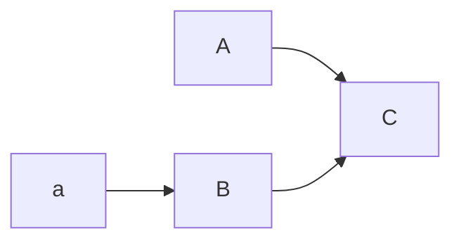

[TOC]


| 这是表格\|xxx\|xxx\| | 语文   | 数学   |
| ---------------- | ---- | ---- |
| 宋启民              | 10   | 23   |
| 黎俐               | 20   | 23   |
|                  |      |      |
|                  |      |      |


#  这是一级标题


1. 这是有序列表
2. 这是有序列表
   * 这是无序列表* + -
     + 以上符号都等价↑
   * 这是无序列表


`这是代码块`

## 这是二级标题

### 这是三级标题

#### 这是四级标题

这是正文

```java
//这是整段代码```
public class Test{
  private String name;
  private int age;
  
  public Test(){}
  
  public Test(String name,int age){
    this.name = name;
    this.age = age;
  }
  
  public static void main(String[] args){
    
  } 
}
```

----

---是以上↑,***也是以上↑

> 这是引用内容>
>
> ">"代表引用
>
> >这是引用的引用
> >
> >1. 引用中可以使用markdown语法
> >2. 这是引用中的markdown语法

超链接[百度](http://www.baidu.com),同时按下ctrl访问

格式为`[百度](网址)`,或者本地超链接`[c盘](C:\)`[C盘](C:\)

*强调*_强调_**强调**__强调__→一个`*`或`_`包围前后是斜体(或者ctrl+i),两个`**`或`__`包围前后是粗体(或者ctrl+b) 

{:height="100px" width="100px"}


先一个惊叹号加一个方括号(图片替代文字)加一个圆括号(图片地址)

图片也可用html标签形式,可设置图片大小


<sqmwin@hotmail.com>---自动链接,左右用尖括号包住

\*反斜杠加有意义的符号=无意义的符号\*

$f^2+\sin(\lambda)$`公式是两个美元包住后再发挥`
$$
两个美元就是公式块
\mathbf(V)_1 \times \mathbf(V)_2 = \begin{matrix}
xxx
\end{matrix}
$$

```sequence
Andrew->China: Says Hello
Note right of China: China thinks\nabout it
China-->Andrew: How are you?
Andrew->>China: I am good thanks!
```




:smile_cat:[Jump to Header 3](#这是三级标题)


