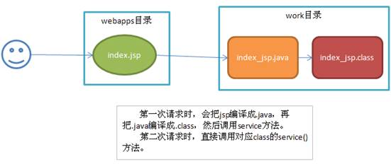

[TOC]

---

# 1. JSP

## 1.1 JSP简介

- Java Server Pages	Java服务器端的网页
- 在服务器端执行
- html + java代码 + JSP动态标签 = jsp

##1.2 Servlet缺点

- 不便于页面调试和维护
- 难以利用网页设计工具进行页面设计
- jsp页面执行时会被翻译成servlet程序

## 1.3 JSP运行

- ==客户端发送request请求→JSP Container将JSP页面翻译成Servlet源码→编译源码,加载至内存→结果是response发送至客户端==



## 1.4 JSP2.0新增功能

- EL表达式
- Simple Tag和Tag File
- web.xml新增`<jsp:config>`元素

##1.5 JSP的脚本元素

- jsp页面可以编写Java代码

| 标签                           | 语法                | 用途                        |
| ---------------------------- | ----------------- | ------------------------- |
| Declaration Tag<br>声明标签(不常用) | `<%! 变量或方法的声明 %>` | 声明jsp页面使用的全局变量或方法或用于定义类   |
| Expression Tag<br>表达式标签      | `<%= 表达式 %> `     | 输出语句,输出到页面,==不能有分号==      |
| Scriptlet Tag<br>程序代码块标签     | `<% 程序代码 %>`      | 编写程序代码,能定义变量语句,==不能定义方法== |

###1.5.1 声明标签补充

- 多个页面用同一个声明,可单独写一个jsp页面放入要用的声明,用`<%@ include file="servletpath"%>`或`<jsp:include page="servletpath"/>`包含起来
- ==不建议用==`<%!xxx%>`声明变量,建议使用`<%xxx%>`申明变量

### 1.5.2 表达式标签补充

- 表达式标签的计算结果会转换成字符串
- 如:`<%="abc"%>`等效于`out.print("abc");`

### 1.5.3 代码块标签补充

- 一个jsp页面可以有多个`<%xxx%>`代码块,JSP服务器会按照从上到下的顺序执行
- 代码块中声明的变量是局部变量,只对当前页面有效

## 1.6 JSP的页面注释

| 注释     | 代码                          | 可见状态          |
| ------ | --------------------------- | ------------- |
| JSP注释  | `<%-- 注释内容 --%>`            | 转化阶段消失,开发者可见  |
| Java注释 | `//注释内容或/*注释内容*/或/**注释内容*/` | 编译阶段小时        |
| HTML注释 | `<!-- 注释内容 -->`             | 不消失,在源代码页面也可见 |

## 1.7 JSP的指令元素

- 功能:用于指示jsp执行某些步骤或表现特定的行为
- 语法格式:`<%@ directive [attribute ="value"] [attribute ="value"]... %>`
  - `<%@ 指令标记 属性名="属性值"...%> ` 

### 1.7.1 page指令标记

- 设置jsp页面的属性
- 属性中除了import可出现多次以外其他属性都只能出现一次
- 重点属性:**session \ import \ contentType \ pageEncoding \ isELIgnored**
- *language*:声明使用的脚本语言类型,值暂时只能是java
  - 例如:`<%@ page language="java" %>`
- *extends*:标明jsp编译时需要加入的Java Class的全名---jsp翻译成的Servlet文件所继承的类
  - 例如:`<%@ page extends="src.class" %>`
- ***session***:指定http的会话是否启用session对象
  - 例如:`<%@ page session="true" %>`:"true"为默认值,值也可以"session"
- ***import***:声明导入的Java包或类的列表(此属性可出现多次)
  - 例如:`<%@ page import="java.util.Date" %>`
- *buffer*:jsp页面对客户端浏览器输出缓冲区的大小,默认是8kb
  - 例如:`<%@ page buffer="8k" %>`
- *autoFlush*:设置是`"true"`(默认)否`"false"`自动刷新缓冲区
- *errorPage*:指定此jsp页面的异常处理页面
  - 例如:`<%@ page errorPage="error.jsp" %>`
- *isErrorPage*:设置此jsp页面是否可以作为其他页面的errorPage对象
  - 例如:`<%@ page isErrorPage="true" %>`
- ***contentType***:定义jsp页面响应的MME类型,服务器端输出内容所采用的编码
  - 例如:`<%@ page contentType="text/html;charset=UTF-8" %>`
- ***isELIgnored***:是否忽略EL表达式
  - 例如:`<%@ page isELIgnored="false" %>`:"false"代表不忽略,计算其值;
- ***pageEncoding***:声明jsp页面翻译成Servlet程序所采用的编码
  - 例如:`<%@ page pageEncoding="utf-8" %>`

### 1.7.2 include指令标记

- 语法格式:`<%@ include file="filename"`
- 作用:在当前jsp页面中静态包含目标路径页面的文件,解析实现其内容
  - filename是静态包含的文件的地址,路径是服务器路径
  - 静态包含是指==在源码阶段就把此文件合并到当前jsp页面==,所以filename不能是一个变量
  - 不能在fliename后接任何参数,如`"filename?nm=browser"`

### 1.7.3 taglib指令标记

- 语法格式:`<%@ taglib 属性="属性值" %>`
- 作用:声明jsp页面中导入的标签库
  - 常用标签库:**JSTL**
- 常用属性:
  - `uri`:标签文件的uri地址
  - `prefix`:使用标签库时的前缀名,shortname.

### 1.7.4 配置全局的错误页面

- 在web.xml中进行配置

```xml
	<error-page>
		<error-code>404</error-code>
		<location>/404.jsp</location>
	</error-page>
	<error-page>
		<error-code>500</error-code>
		<location>/500.jsp</location>
	</error-page>
```

## 1.8 JSP内置对象(隐藏对象)

- 在JSP页面中无需创建可直接使用的变量

| 内置对象<br>*真实对象*                    | 代表内容                                     | 常用方法                                     | 范围<br>Scope |
| :-------------------------------- | ---------------------------------------- | ---------------------------------------- | ----------- |
| request<br>*HttpServletRequest*   | 触发服务器调用的**请求**                           | `setAttribute(String name,Object value)`<br>`Object getAttribute(String name)` | request     |
| response<br>*HttpServletResponse* | 对请求的**响应**                               | `addCookie(Cookie c)`<br>`Writer getWriter()` | page        |
| session<br>*HttpSession*          | 为请求的客户端(浏览器)创建的独立的会话Session对象            | `setAttribute(String name,Object value)`<br>`Object getAttribute(String name)` | session     |
| application<br>*ServletContext*   | 由ServletConfig(web程序配置对象)获得的Servlet上下文(Servlet属性) | `setAttribute(String name,Object value)`<br>`Object getAttribute(String name)` | application |
| config<br>*ServletConfig*         | 此jsp页面的ServletConfig,JSP中此功能没什么用,同时在web,xml中可以配置,但没有配置的必要 | `String getInitParameter(String name)`<br>`Enumeration<String> getInitParameterNames` | page        |
| exception<br>*Throwable*(所有异常父类)  | 此jsp页面运行时的异常                             | 当`<%@page isErrorPage="true"%>`时此对象才生效   | page        |
| page<br>*this(HttpServlet)*       | 此页面对象                                    | 一般==不建议使用==此对象                           | page        |
| out<br>*JspWriter*                | 向输出流写出内容(jsp页面→调用out→JspWriter缓冲区(buffer:默认8kb)→调用`response.getWriter().print()`) | `out.print()`等效于`response.getWriter().print()` | page        |
| pageContest<br>*PageContext*      | 此jsp页面的上下文,页面运行的属性,是一个域对象,可以自己存取值,也可以向其他域存取值 | `setAttribute(String name,Object value,int scope*)` | page        |

###1.8.1 数据范围与作用域

| scope(数据范围) | 域的范围                             | 代表内容    |
| ----------- | -------------------------------- | ------- |
| page(默认)    | pageContext(jsp中比servlet多的一个作用域) | 当前jsp页面 |
| request     | HttpServletRequest               | 一次请求    |
| session     | HttpSession                      | 一次会话    |
| application | ServletContext                   | 整个web应用 |

### 1.8.2 通过page获取其他8个对象

- `getXxx()`
  - 例如`getServletContext()`→获得application对象

### 1.8.3 通过pageContext获取配置的应用程序路径

- 在jsp页面中,取出部署应用程序(tomcat)的名字,这样不管如何部署,所用的路径都是正确的
- 格式`${pageContext.request.contextPath}`
  - 例如`<form action="${pageContext.request.contextPath}/hello.jsp">`
    - 相当于`<form action="http://192.168.1.28/tomcat/hello.jsp">`

### 1.8.4 JSP中显示获取的servlet信息

- 例如提交表单时返回"用户名和密码错误"或"账号已被注册"
  - 在jsp页面中添加`${requestScope.xxx}`,xxx是serlvet中转发的`request.setAttribute("xxx","xxx内容");`

##1.9 JSP标签

- jsp标签→jsp action 元素

###1.9.1 jsp常用标签

* `<jsp:useBean id="beanName" class="jsptest.Person" scope="scope">Body</jsp:useBean>`
  * 查找或实例化一个JavaBean组件(得到相对应的代码)
  * 将标签内的id值与JavaBean类中的属性`pageContext.getAttribute("xxx")`对应,id是JavaBean对象的引用名称
  * class属性值是JavaBean组件的完整类名(包含包名)
  * scope是JavaBean实例对象的储存域范围,只能在此域中作用,默认是page
  * Body部分只在JavaBean对象被创建时才执行
* `<jsp:setProperty property="property" value="value" name="beanName"/>`
  * 设置JavaBean的property属性的属性值value
* `<jsp:getProperty property="key" name="beanName"/>`

  * 获取JavaBean的属性值value
* `<jsp:include page="invoke.jsp"/>`
  * 页面包含page中的文件,路径是服务器端路径.(动态包含)
  * include标签功能等效于`RequestDispatcher.include(String path)方法`
  * include标签:动态引入,引入和被引入的两个jsp页面会被==分别翻译成两个==servlet程序,==在执行时合并两个servlet程序内容==,在请求处理阶段执行合并
  * include指令`<%@ include file="invoke.jsp"%>`:静态引入,引入和被引入的两个jsp页面会被翻译成==一个==servlet程序,==内容是在源文件级别进行合并,在翻译阶段执行合并==
* `<jsp:foward page="fowarding.jsp"/>`
  * 在jsp页面完成请求转发,路径是服务器端路径.
  * foward标签功能等效于`RequestDispatcher.foward(String path)`方法
  * jsp中`<jsp:foward/>`语句后面的代码不会执行(servlet自动在此标签后添加return语句
* `<jsp:param/>`
  * 要写在`<jsp:foward/>`中间,用来传递参数
  * 可使用`request.getParameter(String name)`接收参数


---

# 2. JavaBean和内省

## 2.1 什么是JavaBean

- JavaBean是一个遵循特定写法的Java类,通常具有如下特点:

  - 类中必须有一个无参构造方法
  - 属性私有化
  - 私有化的属性必须通过public方法提供给其他类使用,并且方法的命名规则遵循一定规范

  ```java
  public Class Person{
  	private String name;
    	private int age;
   	public Person(){}
    	public String getName(){...}
    	public int getAge(){...}
    	public void getInfo(){...}
  }
  ```

  ​

- JavaBean作用:

  - ==**用于封装数据**==
  - 其他程序通过反射可获得JavaBean类的对象,进而通过反射JavaBean中的方法获得JavaBean的属性,进而调用方法与属性用于保存数据

## 2.2 JavaBean的属性

- JavaBean的属性可以是任意数据类型,一个JavaBean可以有多个属性
- 每个属性都有getter方法作为属性访问器,有setter方法作为属性修改器
- 每个属性"xxx"的操作器的命名规则为"getXxx"和"setXxx"
- 特例:一个属性可以只有set方法或者只有get方法,可作为只写属性或者只读属性

### 2.2.1 Jsp中使用JavaBean

- Jsp中有三个标签可使用JavaBean,[在1.9.1中](#1.9.1 jsp常用标签),分别是useBean \ setProperty \ getProperty

## 2.2 内省--Introspector

### 2.2.1 访问JavaBean属性的两种方式

1. 直接调用JavaBean中的setXxx()方法或getXxx()方法
2. 通过内省技术访问其属性(java.beans包提供了内省的API)

### 2.2.2内省机制--Introspector

- 内省机制是基于反射的

- 访问JavaBean属性

  - Introspector类获得Bean对象的BeanInfo→通过BeanInfo获得属性的描述器PropertyDescriptor→通过属性描述器获得某个属性相对应的getter\setter方法→通过反射机制调用这些方法

    - ```java
        Person person = new Person();//获得Person类的实例
        	BeanInfo info = Introspector.getBeanInfo(person.class);//通过内省类的方法获得person.class的BeanInfo
        	PropertyDescriptor[] pds = info.getPropertyDescriptors();//通过info获得属性描述器的数组,包含了person所有属性的属性描述器
        	for(PropertyDescriptor pd : pds) {//遍历属性描述器数组,分别获得单个属性的属性描述器
        		String attrName = pd.getName();//获得单个属性名
            	if("想要获取的属性名,例如name".equals(attrName){//判断如果是想要操作的属性
              	Method m = pd.getWriteMethod();//获得pd对应属性的写入方法(例如setName(String name))
                	m.invoke(person,"sqm");//调用person对象的m字符对应的写入方法(例如setName("sqm")),实际参数为"sqm"
              }
        	}
           System.out.println(person.getName());//验证以上的方法效果
        ```

### 2.2.3 beanutils工具包

- beanutils是Apache开发的用于操作JavaBean的工具包,用于简化JavaBean代码的编写
- 导入包
  - commons-beanutils-x.x.x.jar
  - commons-logging-x.x.x.jar
- 常用类
  - BeanUtils
    - `populate(Object bean,Map properties)`
      - 将properties中的key与bean中的属性相对应,bean中的属性值设置为properties中key的value
  - 自定义转换器
    - ` ConvertUtils.register(Converter convert,Class clazz)`
      - 编写一个类实现Converter接口→重写该方法→实现相应功能
      - 在封装前进行注册ConvertUtils.register(Converter convert,Class clazz)→change.class

***

# 3. EL表达式

## 3.1 EL简介

- EL:**Experssion Language** :表达式语言
- JSP2.0中html与css分离,与JavaScript分离,并且Java代码被替换成标签→JSP2.0是纯标签格式的页面→==不包含==`<%...%>` `<%@...%>` `<%=...%>` 
- EL表达式语言对应`<%=...%>`,会被页面输出
- EL格式:`${...}`,例如`${1+2} `.如果希望某个EL被忽略,可在表达式前加"\",例如`\${1+2)`
- EL主要作用:
  - 获取(域对象中的)数据
  - 执行运算
  - 获取web开发中常用对象,利用隐式对象
  - 调用Java方法

## 3.2 使用EL获取数据

- 获取数据格式:`${标识符}`
- 自动获取数据:在执行EL时,会调用方法`pageContext.findAttribute("标识符")`,将标识符作为关键字,分别从page\request\session\application四个域中查找与"标识符"相对应的对象,找到则返回其引用,找不到则返回空字符串`" "`.

  - 例如:`${name}`


### 3.2.1 EL操作对象

- 操作JavaBean的属性:

  - `${person.address.city}`
  - `${person['name']}`对应person.getName()

- 操作集合或数组

  - `${list[1]}`

  - `${array[0]}`

- 操作Map集合的值

  - `${map.key}`和`${map['key']}`对应map.get(key)

### 3.2.2 EL获取与对象中的数据

- 获取域对象的值

  - ```java
    <%
    	pageContext.setAttribute("name", "黄海波");
    	request.setAttribute("name", "美美");
    %>
    ${name}//默认得到page中对应的属性
    ${requestScope.name}
    ```

- 获取域中数组的值

  - ```java
    <%
    	String [] arrs = {"美美","波波","东东","名名"};
    	request.setAttribute("arrs", arrs);
    %>
    ${arrs[2]}
    ```

- 获取域中Map集合的值

  - ```java
    %<
    	Map<int,String> numbers = new HashMap<String,String>;
    	numbers.put(001,"宋启明");
    	numbers.put(002,"黎俐");
    	request.setAttribute("num",numbers);
    %>
    ${num.001}//map.get(001);
    ```

- 域中集合的值为对象,获取对象的值

  - ```java
    <%
      	List<Person> pList = new ArrayList<Person>;
    	pList.add(new Person("sqm",25));
    	pList.add(new Person("ll",25));
    	request.setAttribute("persons",pList);
    %>
    ${persons[0].name}
    ```

##3.3 使用EL执行运算

- 语法:`${运算表达式}`,EL支持如下运算符

- | 运算符                         | 说明                                       | 范例                                       | 结果                     |
  | :-------------------------- | ---------------------------------------- | ---------------------------------------- | ---------------------- |
  | + - * / 或 div % 或 mod       | 加 减 乘 除 取余                               | `${10+5}`或`${10mod5}`                    | 15                     |
  | == 或 eq                     | 等于                                       | `${5==5}`或`${5eq5}`                      | true                   |
  | != 或 ne                     | 不等于                                      | `${5!=5}`或`${5ne5}`                      | false                  |
  | < 或 lt                      | 小于                                       | `${5<5}`或`${5lt5}`                       | false                  |
  | \> 或 gt                     | 大于                                       | `${8>5}`或`${8gt5}`                       | true                   |
  | <= 或 le                     | 小于等于                                     | `${8<=5}`或`${8le5}`                      | false                  |
  | \>= 或 ge                    | 大于等于                                     | `${8>=5}`或`${8ge5}`                      | false                  |
  | && 或 and                    | 与(并且)(交集)                                | `${a && b}`或`${a and b}`                 | true/false             |
  | \|\| 或 or                   | 或(并集)                                    | `${a || b}`或`${a or b}`                  | true/false             |
  | ! 或 not                     | 非                                        | `${!b}`或`${not b}`                       | true/false             |
  | empty                       | 判断值的长度是否为0;判断是否为空(null);可以和not或!一起使用     | `${empty "值"}`:值可以为字符串\数组\集合等<br>`${not empty "值"}` | true/false             |
  | 三元表达式:` ${比较表达式?表达式1:表达式2}` | 如果比较表达式为true,结果为表达式1;如果比较表达式为false,结果为表达式2 | `${person=null?"":person.name`           | 表达式1(true)或表达式2(false) |

###3.3.1 EL中的保留关键字

- 在变量命名是应该避开这些名字,避免编译时发生错误

- | And            | eq        | gt      | true      |
  | -------------- | --------- | ------- | --------- |
  | **Or**         | **ne**    | **le**  | **false** |
  | **No**         | **lt**    | **ge**  | **null**  |
  | **instanceof** | **empty** | **div** | **mod**   |

## 3.4 使用EL获取web开发常用对象

- 格式:`${隐式对象的名称}`:此对象的引用
- 隐藏对象都是Map类型
- EL获取参数时,如果参数不存在,返回的是`" "`,空字符串,而不是`null`,这一点跟request.getParameter()不同

| 隐式对象名称           | 描述                                       | 用法举例                                     |
| ---------------- | ---------------------------------------- | ---------------------------------------- |
| pageScope        | page域中用于保存属性(Attribute)的Map类型的对象;功能相当于`pageContext.getAttribute()`;区别在于pageScope获取时若数据不存在返回的是`" "`空字符串,后者返回的是`null` | 获取page域的name属性的值`${pageScope.name}`      |
| requestScope     | request域中用于保存属性(Attribute)的Map类型的对象      | 获取request域的name属性的值`${requestScope.name}` |
| sessionScope     | session域中用于保存属性(Attribute)的Map类型的对象      | 获取session域的name属性的值`${sessionScope.name}` |
| applicationScope | application域中用于保存属性(Attribute)的Map类型的对象  | 获取application域的name属性的值`${applicationScope.name}` |
| pageContext      | JSP页面的pageContext对象,`pageContext.xxx() `相当于`pageContext().getXxx().xxx` | 获取pageContext中的request对象,使用其某一方法`${pageContext.request.contextPath}` |
| param            | 包含所有请求参数的Map类型的对象;当指定name时,相当于`String request.getParameter(String name) `;当未指定name时,相当于`Map request.getParameterMap() ` | 获取所有请求参数`${param}`                       |
| paramValues      | 同上,返回参数类型是String[],相当于一个参数名对应多个参数值;当指定name时,相当于`request.getParameterValues(String name) ` | 获取name=''cartIDs"的请求参数的值的第一个值`${paramValues.cartIDs[0]}` |
| header           | 包含所有http请求头字段的Map类型的对象                   | 获取请求头为referer的请求头的值`${header.referer}`   |
| headerValues     | 同上,返回参数类型是String[],一个参数名对应多个参数值;如果name中有"-",例如Accept-Encoding,则不能使用headerValues.xxx,要使用`headerValues["Accept-Encoding"]` | 获取请求头为contentType的请求头的值`${headerValues.contentType}` |
| cookie           | 包含所有cookie的Map类型的对象:`Map<String,Cookie>`,key是cookie的名字,value是cookie对象本身;cookie.xxx是获得xxxCookie对象,要获得xxxCookie的名称或值,需要cookie.xxx.name或cookie.xxx.value | 获取cookie中名为verificationCode的值`${cookie.verificationCode.value}` |
| initParam        | 包含了所有web应用的全局初始化参数的Map类型的对象;对应了web.xml文件中的`<context-param>`中的参数 | 获取所有的初始化参数`${initParam}`                 |

- 参数名称中包含._(点,下划线)等特殊字符时,要使用`方法["参数名"]`的形式来获取

  - 例如要获取request中的"login.message"属性值,则使用`${requestScope["login.message"]}`方法

  当EL中给出的不是隐藏对象时，表示在四个域中查找数据。例如：${a}，表示

- 在`${pageScope.a} `中查找，如果找到就返回；
  - 在`${requestScope.a}` 中查找，如果找到就返回；
    - 在`${sessionScope.a}`中查找，如果找到就返回；
      - 在`${applicationScope.a}`中查找，如果找到就返回，找不到就返回空字符串。


## 3.5 使用EL调用Java方法

- 可自定义函数用于调用Java类的方法	
  - 例如`${prefix: method(params)}`
- 在EL中只能调用Java类的==静态方法==
- 被调用的Java类的静态方法,需要在TLD文件中描述,才能被调用
  - TLD文件:标签库描述符文件(Tag Library Descriptor),用于描述自定义函数
- EL自定义函数用于扩展EL本身的功能,可让EL完成普通Java程序的功能

####[EL自定义函数开发步骤](#4.3.3 自定义EL函数开发步骤)

---

# 4. JSTL

## 4.1 什么是JSTL

- JSTL全称:JSP Standard Tag Library,JSP标准标签库

- JSTL作用:

  - 提供给Web开发一个标准通用的标签函数库
  - 结合EL取代直接在页面上嵌入Java程序,提高程序可读性,维护性和方便性
    - JSTL和EL结合,取代`<% .. %>`

- JSTL版本

  - 1.0版 \ 1.1版 \ 1.2版
  - 1.0版:EL表达式未纳入官方规范
  - 1.1版后:EL表达式纳入官方规范

- JSTL的下载与导包

  - JSTL:由Apache组织的Jakarta Project实现
  - [下载地址](http://tomcat.apache.org/taglibs/standard) | [Standard Taglib Doc](http://tomcat.apache.org/taglibs/standard/apidocs/)
  - 容器必须支持Servlet2.4+\JSP2.0+的版本\JavaEE1.4+
    - taglibs-standard-compat-1.2.5.jar
    - taglibs-standard-impl-1.2.5.jar  
    - taglibs-standard-jstlel-1.2.5.jar  
    - taglibs-standard-spec-1.2.5.jar
  - 复制到web/WEB-INF/lib目录下→导包

- JSTL的标签库结构

  ```mermaid
  graph TB;
  	JSTL1.2--重点-->core核心库;
  	JSTL1.2-->FMT格式化;
  	JSTL1.2-->SQL标签库;
  	JSTL1.2-->XML标签库;
  	JSTL1.2-->JSTL函数-EL函数;
  	core核心库-->c.tld-核心的标签库;
  	JSTL函数-EL函数-->fn.tld-EL表达式的标签库;	
  ```

- 在JSP文件中引入标签库

  - **引入核心标签**:`<%@ taglib prefix="c" uri="http://java.sun.com/jsp/jstl/core" %>`
  - 引入格式化标签:`<%@ taglib prefix="fmt" uri="http://java.sun.com/jsp/jstl/fmt" %>`
  - 引入SQL标签:`<%@ taglib prefix="sql" uri="http://java.sun.com/jsp/jstl/sql" %>`
  - 引入XML标签:`<%@ taglib prefix="x" uri="http://java.sun.com/jsp/jstl/xml" %>`
  - **引入JSTL函数**:`<%@ taglib prefix="fn" uri="http://java.sun.com/jsp/jstl/functions" %>`
  - 引入后可直接使用标签库

## 4.2 JSTL中的核心标签

###4.2.1 out和set(重点)

- `<c:out>`标签

  - 作用:输出内容

  - | 属性名       | 属性作用                           | 属性类型    | 属性举例                                     |
    | --------- | ------------------------------ | ------- | ---------------------------------------- |
    | value     | 输出常量或者域范围中的变量(使用EL)            | Object  | `<c:out value="aaa"/>`:输出aa字符串常量<br>`<c:out value="${m}"></c:out>`:输出m的计算变量值 |
    | default   | 当value值为null时,输出默认值            | Object  | `<c:out value="${m}" default="xxx"/>`:当"${m}"值不存在(为null)时,输出"xxx" |
    | escapeXml | 指定是否将`/ \ ' " &`字符转义输出,默认是true | Boolean | `<c:out value="${n}" default="xxx" escapeXml="false"></c:out>`:对特殊字符不转义输出 |

  - `<c:out>`标签的属性都支持EL

- `<c:set>`标签

  - 作用:设置值.

    - 设置Web域中的Map类型的属性对象或JavaBean类型的属性对象的属性.

  - | 属性名      | 属性作用                 | 属性类型   | 是否支持EL | 属性举例                                     |
    | -------- | -------------------- | ------ | ------ | ---------------------------------------- |
    | var      | 设定属性名                | String | false  | `<c:set var="username" value="sqmwin" scope="session"/>`:设置名为"username"的属性,值为"sqmwin",作用域是"session" |
    | value    | 设定属性值(或参数值)          | Object | true   | `<c:set var="city" value="${address.city}" scope="request"/>`:value属性值可以是不同的数据类型 |
    | scope    | 设定属性域                | String | false  |                                          |
    | target   | 设定要set的JavaBean对象    | Object | true   | `<jsp:useBean id="user" class="test.dao.user" scope="page"/>`<br>`<c:set target="${user}" property="username" value="admin"/>` |
    | property | 设定此JavaBean对象要修改的参数名 | String | true   | `<c:set target="${user}" property="password" value="admin"/>`<br>`<c:out value="${user}"></c:out>` |

### 4.2.2 remove

- `<c:remove>`标签
  - 作用:删除各种Web域中的属性
  - 举例:`<c:remove var="username" scope="session"/>`
    - var:要删除的属性的属性名
    - scope:要删除的属性的作用域

### 4.2.3 catch

- `<c:catch var="e">nested name</c:catch>`标签

  - 作用:把嵌套在标签中的内容抛出的异常,捕获并存入指定属性对象中

    ```jsp
    <%@ taglib prefix="c" uri="http://java.sun.com/jsp/jstl/core" %>
    <%@ page contentType="text/html;charset="utf-8" %>
    <c:catch var="e">
    	<%
    		int a = 10/0;
    	%>
    </c:catch>
    ${e.message}<!-- 异常e.getMessage -->
    ${e.cause}<!-- 异常e.getCause -->
    ${e.stackTrace}<!-- 异常e.getStackTrace -->
    ```

### 4.2.4 if和choose(重点)

- `<c:if test="">`标签

  - 作用:构造简单的if-then条件表达式语句

  - | 属性名   | 属性作用                           | 属性类型    | 是否支持EL | 属性举例                                     |
    | ----- | ------------------------------ | ------- | ------ | ---------------------------------------- |
    | test  | 给出条件判断,如果test值是true,执行if标签中的内容 | Boolean | true   | `<c:if test="${(age>10) && (not empty name)}">`<br>`<c:out value="${age}"/>`<br>`</c:if>` |
    | var   | 把test执行结果保存在var指定的属性中          | String  | false  | `<c:if test="${i ge 10}" var="x"></c:if>`<br>`${x}`:把test的计算结果保存入x中 |
    | scope | 指定test执行结果保存的web作用域            | String  | false  | `<c:if test="${i le 10}" var="x" scope="request"></c:if>`:把执行结果保存对象x存入request作用域 |

- `<c:choose>`标签

  - `<c:when test="">`标签

  - `<c:otherwise>`标签

  - 作用:三个标签一起使用构造出复杂的条件判断语句(if-else\if-if-else)

  - ```jsp
    <%@ taglib prefix="c" uri="http://java.sun.com/jsp/jstl/core" %>
    <%@ page contentType="text/html;charset="utf-8" %>
    <c:set var="weekday" value="1" scope="page"></c:set>
    <c:choose>
    	<c:when test="${weekday==0}">星期日</c:when>
    	<c:when test="${weekday==1}">星期一</c:when>
    	<c:when test="${weekday==2}">星期二</c:when>
      	<c:otherwise>不是指定日期</c:otherwise>
    </c:choose>
    ```

### 4.2.5 forEach(重点)

- `<c:forEach>`标签

  - 作用:用于对数组\集合\Map集合对象进行循环迭代(遍历)或者指定重复次数进行迭代

  - | 属性名       | 属性作用                                     | 属性类型    | 是否支持EL | 属性举例                                     |
    | --------- | ---------------------------------------- | ------- | ------ | ---------------------------------------- |
    | var       | 指定遍历的单个数据对象                              | String  | false  | `<c:forEach var="s" items="${list}"></c:forEach>` |
    | items     | 指定要遍历的对象                                 | 任何支持的类型 | true   | 当items为Map集合时,var是key-value对象,通过`${xxx.key}或${xxx.value}`获取键值对的内容;<br>当items为对象集合时,var是每一个对象,通过`${xxx.属性名}`获取对象的属性 |
    | begin     | 指定items时,遍历开始的索引值;<br>未指定items时,遍历开始的int数值 | int     | true   | `<c:forEach var="i" begin="1" end="10" step="2">`<br>`${i}`<br>`</c:forEach>` |
    | end       | 参看begin                                  | int     | true   |                                          |
    | step      | 遍历时的步长(x+=step)                          | int     | true   |                                          |
    | varStatus | 接收循环遍历的信息                                | String  | true   | `<c:forEach var="i" begin="1" end="100" step="1" varStatus="status">`<br>`${status.index}`:当前遍历到的索引值<br>`${status.count}`:当前遍历的个数<br>`${status.first}`:判断当前遍历到的对象是否是第一个<br>`${status.last}`:判断当前遍历到的对象是否是最后一个<br>`${status.current}`:返回当前遍历到的对象,等效于var |

  - ```jsp
    <!-- 遍历10-100的偶数,第一个数字黑色,最后一个数字绿色;每到第三个数,显示红色,其余显示蓝色 -->
    <c:forEach var="i" begin="10" end="100" step="2" varStatus="status">
    	<c:choose>
          	<c:when test="${status.first}">
          		<font color="black">${i}</font>
          	</c:when>
          	<c:when test="${status.last}">
          		<font color="black">${i}</font>
          	</c:when>
      		<c:when test="${status.count%3 eq 0}">
          		<font color="red">${i}</font>
          	</c:when>
          	<c:otherwise>
          		<font color="blue">${i}</font>
          	</c:otherwise>
      	</c:choose>
    </c:forEach>
    ```

### 4.2.6 param

- `<c:param>`标签
  - 作用:传递参数
    - 举例:`<c:param name="username" value="sqmwin"/>`
    - 嵌套在和URL相关的标签中,为URL地址附加参数
      - `<c:import>`
      - `<c:url>`
      - `<c:redirect>`
    - 参数值在传递时会自动编码
      - 例如:传递"中国"时,会转换为"%d6%d0%b9%fa"进行传输

### 4.2.7 import

- `c:import`标签

  - 作用:引入页面

  - | 属性名          | 属性作用                                     | 属性类型   | 是否支持EL | 属性举例                                     |
    | ------------ | ---------------------------------------- | ------ | ------ | ---------------------------------------- |
    | url          | 指定引入文件的地址                                | String | true   | `<c:import url="/jsp/jspTest.jsp"></c:import>` |
    | context      | 当使用相对路径访问外部context资源时，context指定了这个资源的名字。(默认值时当前web程序"/test") | String | true   | `<c:import url="/jsp/jspTest.jsp" context="/test"></c:import>` |
    | var          | 指定引入页面的的内容对象,代表引入的页面                     | String | false  | `<c:import url="/jsp/jspTest.jsp" context="/test" var="content"></c:import>` |
    | scope        | var变量的域范围(默认是page)                       | String | false  | `<c:import url="/jsp/jspTest.jsp" context="/test" var="content" scope="page"></c:import>` |
    | charEncoding | 引入文件的编码格式                                | String | true   | `<c:import url="/jsp/jspTest.jsp" context="/test" var="content" scope="page" charEncoding="utf-8"></c:import>` |
    | varReader    | 以Reader类型指定引入页面的内容                       | Reader | false  |                                          |

    ```jsp
    <c:import url="/jsp/jspTest.jsp" context="/test" var="content" scope="page" charEncoding="utf-8">
    	<c:param name="username" value="sqmwin"></c:param>
    </c:import>
    ```

### 4.2.8 url

- `<c:url>`标签

  - 作用:在此jsp页面构造一个url地址,实现url的重写

    - url重写:将会话标识号以参数的形式附加在url地址后
      - 例如:http://localhost/test/jsp/jspTest.jsp?jsessionid=xxxxxxxxxx

  - | 属性名   | 属性作用                | 属性类型   | 是否支持EL | 属性举例                                     |
    | ----- | ------------------- | ------ | ------ | ---------------------------------------- |
    | value | 指定要构造的url           | String | true   | `<c:url var="myurl" value="/login" context="/test" scope="page">`<br>`<c:param name="username" value="sqmwin"></c:param>`<br>`</c:url>`<br>`<a href="${myurl}">choose</a>` |
    | var   | 构造出的url结果保存在域中的属性名称 | String | false  |                                          |
    | scope | var的作用域范围           | String | false  |                                          |

### 4.2.9 redirect

- `<c:redirect>`标签

  - 作用:实现请求的重定向

  - 等效于`response.sendRedirect("/test/index.jsp");`

  - | 属性名     | 属性作用                 | 属性类型   | 是否支持EL | 属性举例                                     |
    | ------- | -------------------- | ------ | ------ | ---------------------------------------- |
    | url     | 指定要重定向的目标地址(服务器地址)   | String | true   | `<c:redirect url="/index.jsp" context="/test">`<br>`<c:param name="username" value="sqmwin"></c:param>`<br>`</c:redirect>` |
    | context | 指定重定向到的页面所在的web程序的名称 | String | true   |                                          |

### 4.2.10 forTokens(了解)

- 分割字符串

- ```jsp
  <c:forTokens 
  		items=要切分的字符串
  		delims=按着什么格式切分
  		var=定义变量
  		[varStatus="varStatusName"] 
  		[begin="begin"] 
  		[end="end"] 
  		[step="step"]>
  	  //body内容
  </c:forTokens>
  <c:forTokens items="A,B,C,D,E" delims="," var="item" >
    ${item}
  </c:forTokens>
  ```

## 4.3 JSTL中的EL函数标签

### 4.3.1 JSP中使用EL函数

- EL函数用于操作字符串
- 使用前提:
  - [导入JSTL开发包](#4.1 什么是JSTL)
  - 在页面中导入EL函数库
    - `<%@ taglib prefix="fn" uri="http://java.sun.com/jsp/jstl/functions" %>`

### 4.3.2 EL函数库介绍

| EL函数库                                  | EL返回值                    | 对应的Java方法                                |
| -------------------------------------- | ------------------------ | ---------------------------------------- |
| `${fn:toUpperCase("xxx")}`             | 空字符串                     | `String toUpperCase(String input)`       |
| `${fn:toLowerCase("xxx")}`             | 空字符串                     | `String toLowerCase(String input)`       |
| `${fn:trim(" x x x ")}`                | "x x x"                  | `String trim(String input)`              |
| `${fn:length(xxx)}`                    | int                      | `int length(Object obj)`                 |
| `${fn:split(source源字符串,delimiters分隔符}` | String[]                 | `String[] split(String input,String delimiters)` |
| `${fn:join(要合并的字符串数组,separator合并符)}`   | String                   | `String join(String[] inputArray,String separator)` |
| `${fn:indexOf(大字符串,小字符串)}`             | int;不包含返回-1;小字符串为空返回0;   | `int indexOf(String input,String substring)` |
| `${fn:contains(大字符串,小字符串)}`            | Boolean                  | `Boolean contain(String input,String substring)` |
| `${fn:startWith(大字符串,小字符串)}`           | Boolean                  | `Boolean startWith(String input,String substring)` |
| `${fn:endsWith(大字符串,小字符串)}`            | Boolean                  | `Boolean endsWith(String input,String substring)` |
| `${fn:replace(源字符串,要替代的字符串,替代者)}`      | String;替换完的字符串           | `String replace(String input,String substringBefore,String substringAfter)` |
| `${fn:substring(源字符串,begin,end)}`      | String;截取后的字符串           | `String substring(String input,Strig beginIndex,String endIndex)` |
| `${fn:substringAfter(源字符串,子字符串)}`      | String;截取子字符串第一次出现之后的字符串 | `String substringAfter(String input,String substring) ` |
| `${fn:substringBefore(源字符串,子字符串)}`     | String;截取子字符串第一次出现之前的字符串 | `String substringBefore(String input,String substring) |

### 4.3.3 自定义EL函数开发步骤

- EL自定义函数:EL Function
  1. 编写一个Java类的静态方法
  2. 编写标签库描述符文件(tld),描述自定义函数
     - TLD(Tag Library Descriptor)
  3. 在jsp页面导入和使用自定义函数

### 4.3.4 自定义EL函数开发注意事项

- 编写完TLD文件,需把tld文件放置到web/WEB-INF/目录中或者WEB-INF的任意 子目录中,除了classes目录和lib目录
- TLD文件的`<uri>uri</uri>`元素用于指定TLD文件的uri,在jsp文件中通过此uri来引入此tld文件
- TLD文件的`<function>`元素用于描述一个EL自定义函数,例如`<tag>`
  - `<name>`子元素指定==EL自定义函数的名称==
  - `<function-class>`子元素指定了此方法的==完整Java类类名==
  - `<function-signature>`子元素指定Java类中==静态方法的签名==
    - **方法签名:指明方法的返回值类型以及各个参数的类型,各个参数用逗号隔开**

### 4.3.5自定义函数库

1. 写一个类，写一个有返回值的静态方法
   - MyELFunction.java

```java
package jsptest.el.functions;
public class MyELFunctions {
  public static String test() {
    return "EL函数库测试";
  }
} 
```

2. 编写tld文件，可以参数fn.tld文件来写，把此tld文件放到指定文件夹下(例如web/WEB-INF/tld)
   - mytest.tld
     - ==version="2.0"==

``` xml
<? xml version="1.0" encoding="UTF-8" ?>
<taglib xmlns="http://java.sun.com/xml/ns/j2ee" xmlns:xsi="http://www.w3.org/2001/XNLSchema-instance" xsi:schemaLocation="http://java.sun.com/xml/ns/j2ee http://java.sun.com/xml/ns/j2ee/web-jsptaglibrary_2_0.xsd" version="2.0">
	<description>My EL Functions Library</description>
	<display-name>My Functions</display-name>	
  	<tlib-version>1.0</tlib-version>
  	<short-name>fntest</short-name>
  	<uri>http://www.sqmwin.cn/jsp/functions</uri>
  
  	<!--配置自定义EL函数-->
  	<function>
      	 <!--配置方法名称-->
  		<name>mytest</name>
         <!--配置方法所在类的全称-->
  		<function-class>jsptest.el.functions.MyELFunctions</function-class>
      	 <!--配置方法签名-->
      	 <function-signature>String test()</function-signature>
  	</function>
</taglib>
```

3. 在jsp页面导入和使用自定义函数
   - index.jsp

```jsp
<%@ page language="java" import="java.util.*" pageEncoding="UTF-8" %>
<%@ taglib prefix="fntest" uri="/WEB-INF/tld/mytest.tld" %>

<!DOCTYPE HTML PUBLIC "-//W3C//DTD HTML 4.01 Transitional//EN">
<html>
  <body>
    <h1>
      ${fntest:test()}
    </h1>
  </body>
</html>
```

- 如果把mytest.tld文件放到classes\META-INF\mytest.tld，那么就可以把

- `<%@ taglib prefix="fntest" uri="/WEB-INF/tld/mytest.tld" %>`

  修改为`<%@ taglib prefix="fntest" uri="http://www.sqmwin.cn/jsp/functions"%>`对应mytest.tld文件中的\<uri\>元素内容。

---

# 5. 自定义标签库

## 5.1 自定义标签简介

- 作用:替代jsp页面中的Java代码,以标签的形式完成Java代码的功能,提高代码的复用性
- 步骤:
  1. 编写一个实现Tag接口的Java类→标签处理类;
  2. 编写标签库描述符文件(tld),在tld文件中对标签处理器类描述成一个标签.
- 可参考tomcat的examples项目中的[jsp2部分](D:\apache-tomcat-9.0.1\webapps\examples\WEB-INF\jsp2)

## 5.2 SimpleTag接口

- 简单标签:实现SimpleTag接口实现标签功能
- 定义了5个方法
  - setJspContext方法
  - setParent和getParent方法
  - setJspBody方法
  - doTag方法
- 编写简单标签类,只需要继承SimpleTagSupport类

### 5.2.1SimpleTag方法介绍

- `setJspContext(JspContext pc)` 

  - 传入jsp页面的pageContext对象

- `setParent(JspTag parent)` 

  - 设置此标签的父标签处理器对象

- `JspTag getParent()`

  - 获取此标签的父标签

- `setJspBody(JspFragment jspBody)`

  - 传入标签体缓存对象(此对象封装了标签体内容)

- `doTag()`

  - 执行标签,在此方法中编写标签代码逻辑

  ####**SimpleTag接口方法执行顺序**

- 初始化标签

  ​	└─通过setJspContext()传入pageContext

  ​			 ▏

  ​			├──有父标签───通过setParent传入父标签

  ​		  无父标签		            ▏

  ​			├─────────────┴──有属性───通过标签属性的setXxx传入属性值

  ​		   无属性		              		            			    ▏

  ​			└─────────────────────────────┴─通过setJspBody传入标签体

  ​														 ▏  

  ​														└─通过doTag(执行标签)	

- web容器执行标签签顺序图

- ```mermaid
  graph TD;
  	1.初始化标签-.->2.执行标签;
  	2.执行标签-.->doTag;
  	1.初始化标签--传入代表Jsp页面的pageContext-->setJspContext;
  	setJspContext-.无父标签无属性.->setJspBody;
  	setJspContext-.无父标签有属性.->每个属性的setter;
  	setJspContext--有父标签-->setParent;
  	setParent--属性若为EL或脚本,先计算-->每个属性的setter;
  	每个属性的setter--传入JspFragment对象-->setJspBody;
  	setJspBody-->doTag;
  ```

- ​

## 5.3 JspFragment类

- javax.servlet.jsp.tagext.JspFragment类在Jsp2.0中定义
  - 它的对象代表Jsp片段,==不包含Jsp脚本元素==
- 标签体内容用JspFragment对象封装,标签处理器使用getJspBody()调用此对象
- JspFragment类的方法
  - `abstract JspContext getJspContext()`
    - 返回代表调用页面的JspContext对象---pageContext
  - `abstract void invoke(Writer out) throws JspException,IOException`
    - 执行JspFragment对象代表的jsp代码;
    - 参数out指定输出结果所在的输出流;如果out为null,则输出结果写入JspContext.getOut(),可理解为写给浏览器


### 5.3.1 invoke方法

- 作用
  - 控制是否执行和输出标签体内容
    - 在标签处理器中不调用JspFragment.invoke,就不执行标签体内容
  - 控制是否迭代执行标签体内容
    - 在标签处理器中重复调用invoke方法,则会多次执行标签体内容
  - 控制是否对标签体的执行结果进行修改后再输出
    - 调用invoke(out)时,指定out输出流,取出数据进行修改,再输出至原输出流(如jspContext.getOut())

## 5.4 自定义标签入门

### 5.4.1 编写标签类

1. 实现SimpleTag接口
   - 编写一个类,继承SimpleTagSupport类
2. 重写方法,至少有doTag()方法
3. 可通过JspContext的getOut()获取输出对象,输出内容

```java
public class TagTest extends SimpleTagSupport{
  private PageContext pc;
  public void doTag() throws JspException,IOException{
	pc.getOut().write("hello");  
  }
  public void setJspContext(JspContext pc) {
    this.pc = (PageContext)pc;
  }
}
```


### 5.4.2 编写tld文件对标签类进行配置

```xml
	<!-- 配置自定义标签 -->
	<tag>
		<!-- 配置标签名称 -->
		<name>hello</name>
		<!-- 配置标签的类 -->
		<tag-class>test.tag.TagTest</tag-class>
		<!-- 配置标签主体 -->
      	 <!-- empty代表标签体内容为空 -->
		<body-content>empty</body-content>
	</tag>
```

### 5.4.3 在Jsp页面中引入该标签库

此内容与编写的tld文件的`<short-name>`标签和`<uri>`标签相对应

`<%@ taglib prefix="tagtest" uri="http://www.sqm.cn/tagtest/tagtest.tld"  %>`

## 5.5 自定义带有标签体的标签

1. 大部分步骤与自定义标签相同
2. 编写标签类
   - 前两步与自定义标签相同,重写doTag()时,通过getJspBody()获取JspFragment标签体对象,调用invoke(null)
3. 编写tld文件进行配置
   - 配置标签主体内容类型时,中间是scriptless
     - `<body-content>scriptless</body-content>`
4. [在Jsp页面引入此标签库](#5.4.3 在Jsp页面中引入该标签库)

### 5.5.1 body-content的配置

- empty:标签体内容为空,不能有标签体
- JSP:标签体内容可为任意东西,但**SimpleTag已经不再支持**
- scriptless:标签体内容不能是Java代码段,但可以是EL \ JSTL
- tagdependent:标签体内容不做运算,直接显示标签处理器处理结果,标签体内容是EL \ JSP \ JSTL,都不做运算

## 5.6 自定义带有属性的标签

### 5.6.1 编写标签类

- 重写doTag()
- 编写一个属性,**属性必须和标签中的属性相同**
- 提供属性的set方法→setter
- 获取标签主体对象
  - 调用invoke方法

### 5.6.2 编写tld文件进行配置

- `<tag>`自定义标签
  - `<name>`配置标签名
  - `<tag-class>`配置标签的类(全称)
  - `<body-content>scriptless</body-content>`配置标签体内容类型
  - `<attribute>`配置属性
    - `<name>`配置属性名,与类属性名相同
    - `<required>`配置属性是否是必须
    - `<rtexprvalue>`配置属性是否支持EL
    - `<type>`配置属性类型

#### 在tld文件中描述标签属性attribute

| 元素名         | 是否必须指定 | 元素作用                                     |
| ----------- | ------ | ---------------------------------------- |
| description | 否      | 指定属性的描述信息                                |
| name        | 是      | 指定属性名,大小写敏感,要与标签类的属性名相同,不能以jsp \ _jsp \ sun开头 |
| required    | 否      | 指定在标签中此属性是否是必须设定                         |
| rtexprvalue | 否      | runtime expression value 运行时表达式;指定属性是静态(false\默认)还是动态(true);静态只能是静态文本值,动态可以是任意Jsp动态元素 |
| type        | 否      | 指定属性值在标签类中的类型,默认是String                  |


###5.6.3 [在Jsp页面中引入该标签库](#5.4.3 在Jsp页面中引入该标签库)

mytag.java

```java
public class MyTag extends SimpleTagSupport {
	private boolean isFirst;
	private PageContext pc;
  public void setIsFirst(boolean isFirst){
    	this.isFirst = isFirst;
  }
  @Override
  public void doTag() throws JspException,IOException{
    	if(isFirst){
    		JspFragment jspBody = getJspBody();
    		jspBody.invoke(null);
         }
  }
  @Override
  public void setJspContext(JspContext pc) {
    	this.pc = (PageContext)pc;
  }
}
```

mytag.tld

```xml
<tag>
	<name>if</name>
  	<required>true</required>
  	<rtexprvalue>true</rtexprvalue>
  	<type>boolean</type>
</tag>
```