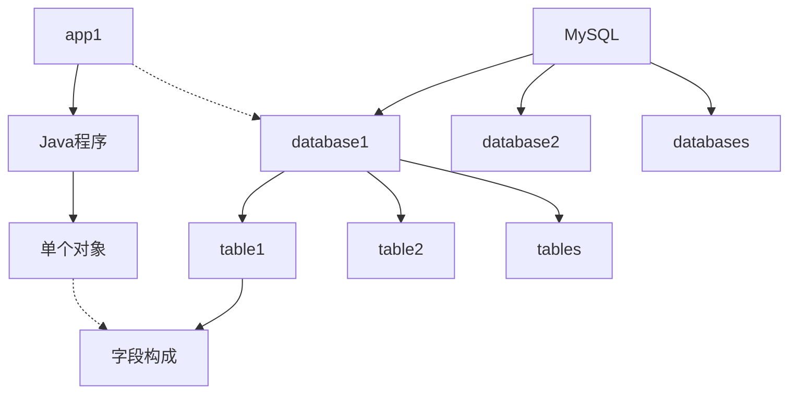
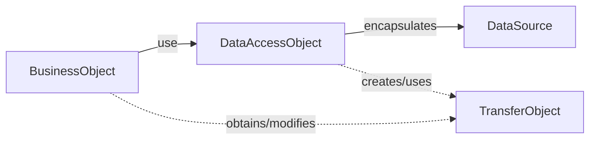
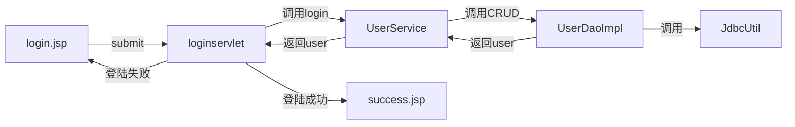
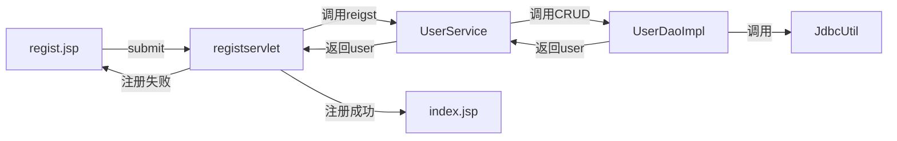

[TOC]

---

#1. MySQL

## 1.1 数据库

- 数据库是一个文件系统,访问数据的时候需要通过SQL语句来访问
  - SQL:Standard Query Language:结构化查询语言

#### 关系型数据库

- 存储的是**实体与实体**之间的关系

#### 常见数据库

- Oracle:甲骨文,收费,大型
- SQLServer:微软,收费,中型
- MySQL:开源,常用5.x版本免费,6.x收费
- DB2:IBM,收费,大型

## 1.2 MySQL简介

### 1.2.1 MySQL的卸载

1. 找到MySQL安装路径,找到my.ini配置文件`C:\ProgramData\MySQL\MySQL Server 5.7\my.ini`
   - 软件安装路径:`# basedir="C:/Program Files/MySQL/MySQL Server 5.7/"`
   - 数据库路径:`datadir=C:/ProgramData/MySQL/MySQL Server 5.7\Data`
2. 卸载数据库,删除以上两个文件夹

### 1.2.2 MySQL的安装

- 版本:mysql-5.7.17.msi | 386M
- 完全安装
- 安装路径**不能有中文**
- MySQL默认端口是3306,**不要修改**
- 设置密码:admin
- 其余看需求设置

### 1.2.3 访问MySQL

- 命令行:`mysql -u root(用户名) -p admin(密码)`
  - 命令行模式下,输入完一段命令后要**以分号;结尾**,否则按Enter键仍然为同一行命令;
  - **密码重置**
    1. 停止mysql服务
       - services.msc
    2. 命令行:`mysqld --skip-grant-tables`(开启一个mysql服务,不需要认证)
    3. 新打开一个cmd窗口,命令行:`mysql -u root -p` 不需要输入密码
    4. `SHOW DATABASES;`:查看数据库
       - `USE 数据库名;`:使用数据库
    5. 修改密码:`UPDATE USER SET PASSWORD=PASSWORD('新密码') WHERE USER='root';`
    6. 关闭两个窗口
    7. 任务管理器结束(mysqld)
    8. 重启mysql服务
- MySQL Workbench
  - 直接运行
  - 密码重置:通过Server→Users and Privileges修改

### 1.2.4 MySQL数据库服务器 \ 数据库 \ 表之间的关系

- 机器安装了tomcat称为web服务器
- 机器安装了MySQL称为数据库服务器
- 命令行访问MySQL数据库服务器`mysql -u root -p 省略主机和端口号 -h -P`
- 每开发**一个软件都对应一个数据库**
  - **一个数据库服务器可有多个数据库**
    - **一个数据库中有多个表**
      - **每个表有多个字段**
        - **每一行(记录)代表一个Java对象**
          - **每一个字段和Java类的属性相对应**
      - **表头为Java对象的属性**



## 1.3 SQL语句(重点)

### 1.3.1 SQL简介

- Structured Query Language:结构化查询语言
- 特点:非过程性语言
  - 非过程性语言:写一条语句就会执行一个结果
  - 过程性语言:下一条语句要依赖上一条或上几条语句
- 加强SQL的过程性语言能力
  - Oracle开发PL\SQL,只能在Oracle中用
  - SQLServer\Sybase的T-SQL
- 作用:SQL用于存取关系数据库,具有**查询,操纵,定义和控制**关系型数据库的四方面功能

### 1.3.2 SQL分类

- DDL(数据定义语言)(data definition language)
  - 用来定义数据库对象(数据库\数据表\视图\索引)
    - 创建数据库\创建表等
- DML(数据操纵语言)(data manipulation language)**重点**
  - 在数据表中**更新修改(update)\插入(insert)\删除(delete)**数据
- DCL(数据控制语言)(data control language)
  - 设置用户权限和控制事务的语句
    - grant \ revoke \ if...else \ while \ begin transaction
- DQL(数据查询语言)(data query language)**重点**
  - 在数据表中**查询数据(select)**

### 1.3.3 数据库

#### 创建数据库

- **创建**数据库:`CREATE DATABASE 数据库名称 [CHARSET 字符集 COLLATE 字符集比较方式]`
  - 查看所有数据库:`SHOW DATABASES`
  - 查看数据库编码集:`SHOW CREATE DATABASE 数据库名`
- **删除**数据库:`DROP DATABASE 数据库名称`
- **修改**数据库属性:`ALTER DATABASE db_name CHARSET charset_name COLLATE collation_name `
- 切换**当前使用**的数据库:`USE db_name`
- **查看**当前正在使用的数据库:`SELECT DATABASE()`

#### 创建表

- 创建表之前先使用`USE db_name`**使用此数据库**

- ```mysql
  CREATE TABLE table_name
  (
  	field1 datatype,
    	列名称2 数据类型,
    	field3 datatype
  )CHARSET charsdet_name COLLATE collation_name
  ```

- 括号中每种数据互相用逗号隔开,**最后一个数据后不需要跟逗号**

- **查看**数据库中所有表名:`SHOW TABLES`

- **查看**表的字段结构描述:`DESC 表名`

- **查看**建表语句和字符集:`SHOW CREATE TABALE tb_name`

- 查看MySQL的编码:`SHOW VARIABLES LIKE 'character%'`

  - 修改系统字符集为utf8
    - 配置mysql/my.ini文件
      - [mysql]后default-character-set=utf8
        - 重启mysql服务

- **删除表**:`DROP TABLE tb_name`

#### MySQL常用数据类型

- 字符串型

  **VARCHAR(n)**:字符长度(L)**最大为n字节**,每个值占用大小为字符长度加一个用来记录长度的字节(即总长度为L+1个字节)

  - 对应Java中的char[n]

  **CHAR(n)**:每个值**占用n个字节**,如果字符长度(L)小于n,MySQL用空格补齐长度

  - 对应Java中的String

- 大数据型

  **BLOB**		---	存放大的二进制数据	---	对应Java中的InputStream	二进制字节输入流		---Binary Large OBjects

  **TEXT**		---	存放大的文本文件		---	对应Java中的Reader		文本输入流

  | 大数据长度类型前缀 | 大数据长度最大值 | 包含类型                    | 中文解释           |
  | --------- | -------- | ----------------------- | -------------- |
  | TINY*     | 255字节    | TINYBLOB \ TINYTEXT     | 极小二进制数据 \ 极小文本 |
  | *         | 64KB     | BLOB \ TEXT             | 二进制数据 \ 文本     |
  | MEDIUM*   | 16MB     | MEDIUMBLOB \ MEDIUMTEXT | 中型二进制数据 \ 中型文本 |
  | LONG*     | 4GB      | LONGBLOB \ LONGTEXT     | 大型二进制数据 \ 大型文本 |

- 数值型

  **TINYINT**		---	极小整型			---	对应Java中的byte		---	0-255(一字节)		

  **SMALLTINT**	---	小整型			---	对应Java中的short	---	-32768-32767(2字节)

  **INT**    		---	整型			---	对应Java中的int		---	四字节

  **BIGINT**		---	大整型			---	对应Java中的long	

  **FLOAT**		---	浮点型			---	对应Java中的float

  **DOUBLE**	---	双精度浮点型		---	对应Java中的double

  - 注意:如果数值字段是需要用在计算中使用时,应储存在数值类型中;如果数值字段是作为字符串显示时使用,应储存在字符串数据类型中(例如id,邮编zip,电话号码等)

- 逻辑性

  **BIT**	---	存放1位数值	---	0或者1	---	对应Java中的boolean

- 日期型

  **DATE**		---	只有日期		---	格式:yyyy-MM-dd

  **TIME**		---	只有时间		---	格式:HH:mm:ss

  **DATEMTIME**	---	日期+时间	---	格式:yyyy-MM-dd HH:mm:ss	---	与TIMESTAMP表现形式相同

  **TIMESTAMP**	---	日期+时间	---	格式:yyyy-MM-dd HH:mm:ss	---	时间戳	---	在数据库中可自动更新

  **YEAR**		---	年			---	1901到2155  				

- **只有字符串型需要写长度,其他数据类型都有默认长度**

#### 定义单个表的字段约束

- 作用:约束用来保证数据有效性和完整性
- **定义主键约束**
  - 主键约束Primary Key:每条信息记录定义一个字段用于唯一区分其他信息记录,这一个字段就是主键
    - 主键:非空,唯一
    - 删除主键:`ALTER TABLE tb_name DROP PRIMARY KEY`
    - 主键自动增长:`AUTO_INCREMENT`
      - 如果主键约束类型为数值型,添加`AUTO_INCREMENT`主键长度自动增长
  - 主键只有一个,若一个主键字段无法保证记录的唯一,可采用联合主键,即由多个字段共同构成主键约束
    - 在创建表时添加此格式:`CONSTRAINT 主键ID PRIMARY KEY (主键字段1,主键字段2);`
    - 添加主键:`ALTER TABLE 表名 ADD PRIMARY KEY(主键字段1,...);`
- 定义唯一约束
  - 唯一:`UNIQUE`
    - `name VARCHAR(20) UNIQUE`
  - 修改约束:`ALTER TABLE 表名 CHANGE 字段名 (新)字段名 字段数据类型 字段约束;`
- 定义非空约束
  - 非空:`NOT NULL`
    - `salary DOUBLE NOT NULL`
- 一张表可以有多个唯一约束,但只能有一个主键约束

```mysql
CREATE TABLE employee (
	id	INT	PRIMARY KEY	AUTO_INCREMENT,
  	name	VARCHAR(20)	UNIQUE	NOT NULL,
	gender	VARCHAR(6)	NOT NULL,
  	birthday	DATE	NOT NULL,
  	entry_date	DATE	NOT NULL,
  	job	VARCHAR(30)	NOT NULL,
  	salary	DOUBLE	NOT NULL,
  	resume	LONGTEXT
)
```

#### 修改表

- 使用`ALTER TABLE`语句追加,修改,删除列

- 增加列及其语法:

  - ```mysql
    //ALTER TABLE 表名 ADD 列名 数据类型 约束
    ALTER TABLE tb_name
    ADD		   (column datatype [DEFAULT expr]
    		   [, column datatype]...);
    //增加单项可不插入括号
    ```

- 修改现有列的数据类型 \ 数据长度 \ 约束:

  - ```mysql
    //ALTER TABLE 表名 MODIFY 列名 新数据类型(新数据长度) 新约束
    ALTER TABLE tb_name
    MODIFY	   (column datatype [DEFAULT expr]
    		   [, column datatype]...);
    ```

- 修改现有列的列名及其语法语法

  - ```mysql
    //ALTER TABLE 表名 CHANGE 旧列名 新列名 类型(长度) 约束
    ```

- 删除现有列

  - ```mysql
    //ALTER TABLE 表名 DROP 列名
    ```

- 修改表名

  - ```mysql
    //RENAME TABLE 旧表名 TO 新表名
    ```

- 修改表的字符集

  - ```mysql
    //ALTER TABLE 表名 CHARSET utf8
    ```

  ​

###1.3.4 数据库数据的操作(CRUD)

#### INSERT语句 (增加数据) create

- 向表中插入数据

- ```mysql
  //INSERT INTO 表名 (字段1,字段2,...) VALUES (字段1数据,字段2数据,...)
  INSERT INTO	tb_name [(column [, column...])] 
  VALUES (value [, value...]);
  ```

- 插入的数据的数据类型应与字段的数据类型相同

- 插入数据的大小应在数据类型规定范围内

- VALUES中列出的数据应当与被加入列一一对应

- 字符型和日期型应当包含在**单引号**中

- 插入空值`INSERT INTO tb_name VALUES (null)`

#### UPDATE语句 (更新(修改)数据) update

- 修改表中数据

- ```mysql
  //UPDATE 表名 SET 字段1=值1,字段2=值2,... WHERE 特征字段=对应值
  UPDATE 	tb_name    
  SET col_name1=expr1 [, col_name2=expr2 ...]    
  [WHERE where_definition]    
  ```

- 如果没有指定WHERE条件,默认更新所有记录

- 如果不用主键当WHERE语句,会报错,需修改update mode

  - `SET SQL_SAFE_UPDATES = 0`:0则WHERE语句可任意使用,1则WHERE语句必须使用主键

- 有WHERE条件,用于指定某一条或多条

  - 例如`WHERE username='sqm'`或者`WHERE job='HR'`

#### DELETE语句 (删除数据) delete

- 删除表中数据

- ```mysql
  DELETE FROM 表名 WHERE 特征
  ```

- 如果没有指定WHERE条件,则删除表中全部数据

- DELETE删除一行或多行数据,不能删除某一列(字段)的值,一般不建议一次删除一列

- 删除整个表的数据但保留表结构:`TRUNCATE TABLE 表名`

  - 直接删除整个表:`DROP TABLE 表名`
    - 删除指定数据`DELETE FROM 表名 [WHERE 特征]`

#### SELECT语句 (查找数据) retrieve

- ```mysql
  SELECT [DISTINCT] *|{column1, column2. column3..}
  		FROM 表名;
  ```

- *代表查询所有列

  - column代表查询的列

- **DISTINCT**(可选):显示时是否剔除重复的行

- 查询的列可以运算

  - 例如查询时在salary上+1000:`SELECT id,username,salary+1000 FROM user`
  - 例如查询时获取总成绩:`SELECT name,math+english+chinese FROM student;`

- 查询的列可以使用别名表示

  - 字段 as 别名,as可省略
    - 例如使用sum表示总成绩:`SELECT name,(math+english+chinese) AS sum FROM STUDENT;`

- WHERE中常用的运算符

- | 运算符类型 | 运算符                         | 意义                                |
  | ----- | --------------------------- | --------------------------------- |
  | 比较运算符 | `> < <= >= = <>`            | 大于 \ 小于 \ 小于等于 \ 大于等于 \ 等于 \ 不等于  |
  | ~     | 字段 IN(set)                  | 显示在in列表中的值,例如salary in(100,200)   |
  | ~     | 字段 LIKE '张%' ; 字段 LIKE '张_' | 模糊查询                              |
  | ~     | 字段 is null                  | 判断是否为空                            |
  | 逻辑运算符 | and                         | 并集,与,多个条件同时成立                     |
  | ~     | or                          | 交集,或,多个条件任一成立                     |
  | ~     | not                         | 不成立,例如`WHERE NOT(salary > 10000)` |

  - LIKE语句中,%代表零或任意多个字符,_代表一个字符,例如:`WHERE name LIKE _a%`

- 使用**ORDER BY 排序**查询结果

- ```mysql
  SELECT column1, column2. column3..
  		FROM	表名;
  ORDER BY 列名 ASC|DESC
  ```

- **ASC**:ascending:升序

  - **DESC**:descending:降序

- **ORDER BY** 永远**出现在SELECT语句末尾**

  - 例如`SELECT salary WHERE job='HR' FROM  user ORDER BY DESC`

- **聚集函数**

  - **COUNT**:用于获取**数量**

  - 得到某一列中行的总数

  - ```mysql
    SELECT COUNT(*)|COUNT(列名(字段)) FROM 表名 
    	[WHERE where_definition]
    ```

  - 统计满足WHERE条件的一共有多少个

    - 例如:薪金大于10000的有多少个
      - `SELECT COUNT(*) FROM user WHERE salary>10000;`

  - **SUM**:用于获取满足WHERE条件的**和**(忽略NULL)

  - ```mysql
    SELECT SUM(数值字段1+数值字段2...),SUM(数值字段3),... FROM 表名
    	[WHERE where_definition]
    ```

  - SUM**仅对数值起作用**,否则会报错

  - 多列分别求和时,之间要用逗号隔开

  - `IFNULL(数值数据,0)`:如果为NULL,则值是0

    - 获取工资总额
      - `SELECT SUM(IFNULL(salary,0) + cash)` FROM user

  - **AVG**:用于获取满足WHERE条件的**平均数**

  - ```mysql
    SELECT AVG(数值字段),...	FROM 表名
    	[WHERE where_definition]
    ```

  - **MAX \ MIN**: 获取满足WHERE条件的一列的最大值或最小值

  - ```mysql
    SELECT MAX(数值字段)|MIN(数值字段) 	FROM 表名
    	[WHERE where_definition]
    ```

- GROUP BY  分组

  - 将查询结果按照字段的值相同的分在一组

  - 使用GROUP BY时,只能是**聚集函数**,**SELECT的字段中必须有GROUP BY的字段属性**

  - 条件过滤不能使用WHERE,要使用**HAVING**

  - ```MYSQL
    SELECT id,username,COUNT(*),SUM(salary) FROM user GROUP BY id HAVING SUM(salary);
    //GROUP BY的字符段在SELECT中→分组是在选择的字段中分组
    ```

- **SELECT语句顺序**:

  - `SELECT ... FROM ... WHERE ... GROUP BY ... HAVING ... ORDER BY ...`

### 1.3.5 多表设计---外键约束

#### 外键约束

- 表示这个属性是另一个实体集中的主标识属性，即另一个表中的主键

```mysql
CREATE DATABASE shoes CHARSET utf8 COLLATE utf8_bin;
USE shoes;
CREATE TABLE product(
	id	INT	PRIMARY KEY,
  	name	VARCHAR(50)	NOT NULL,
  	price	DOUBLE	NOT NULL
)

CREATE TABLE shop(
	id	INT	PRIMARY KEY,
  	name	VARCHAR(50) NOT NULL,
  	product_id	INT	NOT NULL
)

INSERT INTO product(id,name,price) VALUES(1,"鞋",1000);
INSERT INTO product(id,name,price) VALUES(2,"眼镜",100);
INSERT INTO product(id,name,price) VALUES(3,"上衣",800);
INSERT INTO product(id,name,price) VALUES(4,"帽子",200);
INSERT INTO product(id,name,price) VALUES(5,"裤子",500);


INSERT INTO shop(id,name,product_id) VALUES(1,"上衣一分店",3);
INSERT INTO shop(id,name,product_id) VALUES(2,"鞋一分店",1);
INSERT INTO shop(id,name,product_id) VALUES(3,"上衣二分店",3);
INSERT INTO shop(id,name,product_id) VALUES(4,"上衣三分店",3);
INSERT INTO shop(id,name,product_id) VALUES(5,"眼镜一分店",2);
INSERT INTO shop(id,name,product_id) VALUES(6,"帽子一分店",4);
INSERT INTO shop(id,name,product_id) VALUES(7,"裤子一分店",5);
INSERT INTO shop(id,name,product_id) VALUES(8,"裤子二分店",5);
```

- 通过外键约束建立连个表之间的关系
  - 建立了两个表之间的联系
  - 保证数据的完整性

#### 添加外键


- ```mysql
  //ALTER TABLE 表2名 ADD FOREIGN KEY 表2名(外键名) REFERENCES 关联的表名(关联键名);
  ALTER TABLE shop ADD FOREIGN KEY shop(product_id) REFERENCES product(id);
  ```

- 在创建表时直接定义外键约束

  - ```mysql
    CREATE TABLE factory(
    	id	INT	PRIMARY KEY,
      	name	VARCHAR(50)	NOT NULL,
      	address	VARCHAR(50)	NOT NULL,
      	product_id	INT NOT NULL,
      	FOREIGN KEY (product_id) REFERENCES product(id)
    )
    ```

  - `//FOREIGN KEY (外键名) REFERENCES 关联的表名(关联的键)`

####M:N的联系引入关系表

- product和shop的关系为1:1
  - 若加入表3:factory,与表product联系后,则关系表为1:2→product:(shop,factory)
- 联系的属性及两个实体的主标识形成关系表
- 关系表的主键为两个实体主标识的组合
- M:N→多对多
- 1:N→一对多(无需引入关系表)
- 1:1→一对一(无需引入关系表)

#### 笛卡尔积

- 表1的数据分别与表2数据结合获得;


- `SELECT *FROM 表1 ,表2;`

#### 多表查询

- **内连接**(用的比较多)
  - 两张表按照条件合并显示
  - 普通内连接
    - 前提条件:需要有外键
    - 关键字:`INNER JOIN 表2名 ON 条件`
    - 例如:`SELECT * FROM product INNER JOIN factory ON product.id=factory.product_id`;
  - **隐式内连接**(用得最多)
    - 省略`INNER JOIN ... ON`关键字
    - `INNER JOIN`用逗号,替代;`ON`用`WHERE`替代
    - 例如:`SELECT * FROM product,factory WHERE product.in=factory.product_id;`
- 外连接
  - 两张表按照条件显示在一起,不合并
  - 左外连接(符合on要求的看左表,左表数据全部显示)
    - 前提条件:需要有外键
    - 关键字:`[A] LEFT [OUTER] JOIN 表2名 ON 条件`
    - 例如:`SELECT * FROM product LEFT OUTER JOIN factory ON product.in=factory.product_id;`
  - 右外连接(符合on要求的看右表,右表数据全部显示)
    - 前提条件:需要有外键
    - 关键字:`[A] RIGHT [OUTER] JOIN 表2名 ON 条件`
    - 例如:`SELECT * FROM product RIGHT JOIN factory ON product.in=factory.product_id;`
  - 全连接(显示两个表的全部数据,没有的用null表示)
    - 前提条件:需要有外键
    - 关键字:`[A] FULL [OUTER] JOIN 表2名 ON 条件`
    - 例如:`SELECT * FROM product A FULL JOIN factory ON product.in=factory.product_id;`


---

# 2. JDBC

## 2.1 JDBC 介绍

- JDBC :Java Database Connectivity: Java数据库连接

  - 通过Java语言来连接数据库
  - 由一些接口和类组成

- JDBC是一套标准,用于**简化\统一**数据库的操作

- 驱动:特指应用程序与数据库之间的通信的规范

- ```mermaid
  graph LR;
  	应用程序--访问-->JDBC;
  	JDBC-->应用程序;
  	JDBC--调用-->数据库驱动;
  	数据库驱动-->JDBC;
  	数据库驱动--通信-->数据库;
  	数据库--通信-->数据库驱动;
  ```

- 组成JDBC的两个包

  - java.sql

    - 类	DriverMangaer	驱动管理器

    - 接口    Connection        连接器

    - Statement

      - PreparedStatement
      - CallableStatement(用于调用储存过程)

    - ResultSet

    - ```mermaid
      graph LR;
      	DriverManager--create-->Connection;
      	Connection--create-->Statement;
      	Statement--create-->ResultSet;
      	PreparedStatement-.extends.->Statement;
      	CallableStatement-.extends.->PreparedStatement;
      ```

  - javax.sql

    - 接口	DataSource	数据源

## 2.2 JDBC入门

- 编程从user表中读取数据,打印在命令行

- 流程:

  1. 搭建实验环境

     1. 在MySQL中创建一个库,并创建user表和插入表的数据
     2. 新建一个Java工程,并导入数据驱动
        - 驱动jar包:mysql-connector-java-5.x.x-bin.jar:用于连接MySQL数据库的包
        - ojdbc14.jar:用于连接Oracle数据库的包
        - sqljdbc4.jar:用于连接SQLserver数据库的包

  2. 编写程序,在程序中加载数据库驱动

     1. 驱动管理器注册驱动:`DriveManager.registerDriver(Driver driver);`→`Driver driver = new Driver();`
        - 此Driver是JDBC的驱动,在包com.mysql.jdbc;中
        - DriverManager在java.sql包中,本例其他对象都在此包中

  3. 建立连接

     1. 通过驱动管理器获得连接对象:`Connection con = DriverManager.getConnection(String url,String username,String password) `
        - url:数据库的地址
          - 例如:本机数据库:`"jdbc:mysql://localhost:3306/数据库名"`
        - username:数据库用户名,默认root
        - password:数据库登陆密码,安装时自己设置的,例如admin

  4. 创建用于向数据库发送SQL的Statement对象,并发送操作SQL语句

     1. 通过连接对象创建sql声明对象:`Statement st = con.createStatement();`
     2. 通过sql声明对象来发送sql语句
        1. 创建操作sql语句:以String方式写出sql语句
           - `String sql = "SELECT * FROM user";`
        2. 通过sql声明对象执行sql语句,并用ResultSet结果集接收
           - `ResultSet result = st.executeQuery(sql); `

  5. 从ResultSet结果集中取出数据,打印到窗口

     - 遍历ResultSet

     - ```java
       System.out.println("+-----------------------------------------+");
       System.out.println("|id  \t|username\t|salary\t|job\t|");
       while(result.next()){
         int id = result.getInt("id");
         String username = result.getString("username");
         double salary = result.getDouble("salary");
         String job = result.getString("job");
         System.out.println("|" + id + "\t|" + username + "\t|" + salary + "\t|" + job + "\t|");
       }
       System.out.println("+-----------------------------------------+");
       ```

- JDBC编程步骤:

- ```mermaid
  graph LR;
  	装载驱动程序-->建立连接;
  	建立连接-->操作数据;
  	操作数据-->释放资源;
  	获得连接-->创建语句;
  	创建语句-->执行语句;
  	执行语句-->处理结果;
  	装载驱动程序-.-获得连接;
  	建立连接-.-获得连接;
  	操作数据-.-创建语句;
  	操作数据-.-执行语句;
  	操作数据-.-处理结果;
  ```

## 2.3 JDBC API

### 2.3.1 DriverManager类

- 驱动管理器类,可装载很多数据库驱动


- 用于加载驱动(Driver),创建与数据库的连接(Connection)
  - 静态方法注册驱动,获得基于驱动的与数据库的连接对象
  - `DriverManager.registerDriver(new Driver());`
  - `DriverManager.getConnection(url,username,password);`
- 方法分析:
  - 结论:注册驱动不推荐采用registerDriver()方法,推荐使用反射获取驱动`Class.forName("com.mysql.jdbc.Driver");`
  - `public static synchronized void registerDriver(java.sql.Driver driver)`
    - 参数是java.sql.Driver,而传递的是com.mysql.jdbc.Driver
    - 在com.mysql.jdbc.Driver类中有一段静态代码块,会直接获取一个mysql的驱动对象
    - 所以驱动会注册两次,装载两个mysql驱动,依赖于mysql的API
- 使用反射注册驱动:`Class.forName("com.mysql.jdbc.Driver")`
  - 只加载一次驱动,装入一个驱动对象
  - 降低耦合,不依赖MySQL的API,程序灵活性更高
  - 开发时不建议用具体的驱动类型调用getConnection,而使用DriverManager调用getConnection获取连接对象
- `Connection DriverManager.getConnection(String url,String username,String password);`
  - url作用:**用于指定哪一个驱动,指定数据库位置**
    - jdbc	:	mysql	:	//localhost:3306	/	test		?key=value
    - 主协议             子协议              主机:端口                   数据库          访问属性
  - oracle写法: jdbc:oracle:thin:@localhost:1521:sid
    - sid即为数据库访问id
  - **mysql的url简写:`jdbc:mysql///test`**
  - 常用属性
    - useUnicode=true&characterEncoding=UTF-8

### 2.3.2 Connection接口

- 代表程序与数据库的连接对象
- 作用:
  1. 获得操作SQL的对象(Statement)
  2. 对数据库的事务进行管理(Commit)

####获得操作SQL的对象

- `Statement createStatement()`
  - 创建一个向数据库发送sql的Statement对象
- `PreparedStatement prepareStatement(String sql) `
  - 创建一个**向数据库发送预编译sql**的PreparedStatement对象
- `CallableStatement prepareCall(String sql)`
  - 创建一个**执行存储过程**的CallableStatement对象

#### 对数据库事务进行管理

- `setAutoCommit(boolean flag)`
  - 是否开启自动提交事务
- `commit()`
  - 在链接上**提交**数据库事务
- `rollback()`
  - 在链接上**回滚**数据库事务

### 2.3.3 Statement

- 用于**向数据库发送执行sql语句**
- 作用:
  1. 执行sql语句
  2. 批处理操作

#### 执行SQL语句

- `ResultSet executeQuery(String sql)`
  - 向数据库发送查询语句(SELECT),返回ResultSet结果集
- `int executeUpdate(String sql)`
  - 向数据库发送修改语句(INSERT\UPDATE\DELETE),返回int类型的影响记录行数
    - 返回值若为0则修改失败
- `boolean execute(String sql)`
  - 向数据库发送任意SQL语句,如果结果为ResultSet对象,则返回true;如果为更新计数或不存在结果,则返回false
    - 后续使用`getResultSet()`方法或`getUpdateCount()`方法获取结果,使用`getMoreResults()`移动后续结果

#### 批处理操作

- 发送多条sql语句
- `addBatch(String sql)`
  - 将多条sql语句放入批处理队列
- `executeBatch()`
  - 执行批处理,只想队列中所有的sql语句,发送至数据库

### 2.3.4 ResultSet

- 代表sql语句执行的结果,ResultSet封装了执行结果,采用的是**类似表格**的方式,获取结果时,通过**游标**(cursor)指向每个结果,从而调用方法获取结果中的数据
  - 游标每次获取一个数据行,初始时游标指向第一行之前,之后调用next()方法游标则换到下个数据行.
- `Object getObject(int index)`
- `Object getObject(String column)`
- 获取指定类型的数据
- `String getString(int index)`
- `String getString(String columnName)`
- `xxx getXxx(int index)`
- `xxx getXxx(String columnName)`

### 2.3.5常见数据类型转换表

| SQL类型                    | JDBC获得数据方法                | 返回类型               |
| ------------------------ | ------------------------- | ------------------ |
| BIT(1) \ BIT(10)         | getBoolean() \ getBytes() | boolean \ byte[]   |
| TINYINT                  | getByte()                 | byte               |
| SMALLINT                 | getShort()                | short              |
| INT                      | getInt()                  | int                |
| BIGINT                   | getLong()                 | long               |
| CHAR,VARCHAR,LONGVARCHAR | getString()               | String             |
| TEXT \ BLOB              | getClob() \ getBlob()     | Clob \ Blob        |
| DATE                     | getDate()                 | java.sql.Date      |
| TIME                     | getTime()                 | java.sql.Time      |
| TIMESTAMP                | getTimestamp()            | java.sql.Timestamp |

- ResultSet的方法:getXxx()的**形式参数**有:

  - (int columnIndex)---列索引(字段索引)
  - (String columnLabel)---列标签(字段名)

- 使用ResultSet遍历结果集

  - 使用`boolean next()`判断是否有下一条记录,有则返回true,游标指向下一行,没有则返回false

  - ```java
    while(next()){
    	//根据字段的数据类型,选择相应的getXxx方法
      	//getInt...
      	//getString...
    }
    ```

### 2.3.6 ResultSet的滚动结果集

- Connection对象调用createStatement()方法创建Statement对象时使用带参方法,指定返回的ResultSet的属性
- `Statement createStatement(int resultSetType,int resultSetConcurrency)`
  - resultSetType	---	结果集类型
    - `ResultSet.TYPE_FORWARD_ONLY`:游标只能向前,只能调用next()**不能向回滚动**
    - `ResultSet.TYPE_SCROLL_INSENSITIVE`:支持结果集游标**向回滚动**,不能查看修改结果
    - `ResultSet.TYPE_SCROLL_SENSITIVE`:支持结果集向回滚动,可以查看修改结果
  - resultSetConcurrency   ---     结果集并发策略
    - `ResultSet.CONCUR_READ_ONLY`:只读,并发模式不能更改
    - `ResultSet.CONCUR_UPDATABLE`:可修改,ResultSet对象的并发模式可以更改
  - 常见三种组合
    1. TYPE_FORWARD_ONLY,CONCUR_READ_ONLY:(无参默认)不能向回滚动,只读
       - 只能迭代一次
    2. TYPE_SCROLL_INSENSITIVE,CONCUR_READ_ONLY:只读,支持向回滚动
    3. TYPE_SCROLL_SENSITIVE,CONCUR_UPDATABLE:支持向回滚动,支持数据修改
  - ResultSet类的方法结合使用:
    - `boolean next()`:移动到下一行
    - `boolean previous()`:移动到前一行
    - `boolean absolute(int row)`:移动到指定行号的行
    - `void beforeFirst()`:移动游标到resultSet最前面
    - `void afterLast()`:移动游标到resultSet最后面
    - `void updateXxx(int columnIndex,Xxx new)`:在当前的游标行,把对应列索引的值更新为new值
    - `void updateXxx(String columnLabel,Xxx new)`:在当前的游标行,把对应列标签(字段)的值更新为new值
    - `void updateRow()`:更新行数据,确认修改
- `Statement createStatement(int resultSetType,int resultSetConcurrency,int resultSetHoldability)`
  - resultSetHoldability	---	结果集可保存性
    - `ResultSet.HOLD_CURSORS_OVER_COMMIT`:提交事务时,ResultSet对象可保存性为开放状态
    - `ResultSet.CLOSE_CURSORS_AT_COMMIT`:提交事务时,ResultSet对象可保存性为关闭状态

### 2.3.7 关闭资源

- 释放资源
  - JDBC运行完后关闭与数据库交互的对象
    - Connection对象,最早释放
    - Statement对象
    - ResultSet对象
  - 释放资源代码要放入finally语句中
    - 判断如果对象不为null,则close()

## 2.4 JDBC完成CRDU操作

###2.4.1 增删改查

- 增删改:Statement对象的`int executeUpdate(String sql)`

- 查:Statement对象的`ResultSet executeQuery(String sql)`

  - ```java
    //通过类加载器注册驱动
    Class.forName("com.mysql.jdbc.Driver");
    //通过驱动管理器创建对应数据库的连接对象
    Connection con = DriverManager.createConnection("jdbc:mysql///test","root","admin");
    //通过数据库连接对象创建声明对象,用于CRDU操作
    Statement statement = con.getStatement();

    //增Create
    String sql1 = "insert into customers(cust_id,cust_name) values(1000000006,sqm)";
    int num1 = statement.executeUpdate(sql1);
    if (num1>0) {
      	System.out.println("插入成功");
    }
    //改Update
    String sql2 = "update customers set cust_name='Qiming Song' where cust_id = '1000000006'";
    int num2 = statement.executeUpdate(sql2);
    if (num2>0) {
      	System.out.println("修改成功");
    }
    //删Delete
    String sql3 = "delete from customers where cust_id='1000000006'";
    int num3 = statement.executeUpdate(sql3);
    if (num3>0){
      	System.out.println("删除成功");
    }
    //查Retrieve
    String sql4 = "select * from customers where cust_id='1000000005'";
    ResultSet result = statement.executeQuery(sql4);
    while(result.next()){
    	//根据列表数据类型,获取相应数据
    }
    ```

### 2.4.2 JdbcUtils抽取

- 简化方法,每次都有重复的代码(注册驱动,创建链接,创建声明),通过抽取至Utils类中调用
- 只抽取到Connection
  - 把注册驱动和获取连接封装至JdbcUtils的getConnections()方法中

- 将关于连接数据库的信息(驱动类名,数据库地址,用户名,密码)定义到配置文件(*.properties)中,然后读取配置文件进行加载

  - 通过ResourceBundle类的`getBundle(String baseName)`方法获取配置文件,位于src目录下,名称为baseName,文件类型后缀为`properties`,再通过获取的配置文件调用`getString(String key)`方法,获取键对应的值

  - ```
      driverclass=com.mysql.jdbc.Driver
      url=jdbc:mysql///test
      username=root
      password=admin
      ```

- 通过JdbcUtils类获取配置文件并抽取CRDU的方法

- ```java
    public class JdbcUtils {
        //将对应数据库驱动类,数据库url,数据库用户和密码都定义为私有(private)静态(static)常量(final),通过ResourceBoundle类的方法获取相应字符串
        private static final DRIVERCLASS;
        private static final URL;
        private static final USERNAME;
        private static final PASSWORD;
        private static Connection con;
        //之后注册驱动和获取连接都要用到
        
        //静态导入配置文件中的各个具体配置
        static {
            DRIVERCLASS=ResourceBundle.getBundle("jdbc").getString("driverclass");
            URL=ResourceBundle.getBundle("jdbc").getString("url");
            USERNAME=ResourceBundle.getBundle("jdbc").getString("username");
            PASSWORD=ResourceBundle.getBundle("jdbc").getString("password");	
        }
        
        //将加载驱动的操作放入静态代码块中,当加载类(import)的时候,静态代码块的内容会先初始化
    	//将连接数据库放入静态代码块中
        static {
          try {
            class.forName(DRIVERCLASS);
            con.DriverManager.getConnection(URL,USERNAME,PASSWORD)
          }
          catch (ClassNotFoundException e) {
            e.printStackTrace();
          }
          catch (SQLException e) {
            e.printStackTrace();
          }
        }
      
        //创建一个静态方法,抽取调用Connection的方法
        public static Connection getConnection() throws SQLException {
              return con;
        }
        
        //创建各个资源的关闭方法
        //关闭连接对象资源
        //关闭声明对象资源
        //关闭获得的结果集对象资源
        //关闭资源的方法一定要放在finally代码块中
        public static void close(Connection con) throws SQLException {
            if(con != null) {
              con.close();
            }
        }
          public static void close(Connection con,Statement statement) throws SQLException {
            if(con != null) {
              con.close();
            }
            if(statement != null) {
              statement.close();
            }
        }
        public static void close(Connection con,Statement statement,ResultSet result) throws SQLException {
            if(con != null) {
              con.close();
            }
            if(statement != null) {
              statement.close();
            }
            if(result != null) {
              result.close();
            }
        }
    }
    ```
## 2.5 DAO模式

- Data Access Object 数据访问对象模式:在持久层**通过DAO将数据源操作封装**,**业务层通过操作Java对象,**完成对数据源的操作
  - 业务层无需知道底层数据源,而是通过Java对象操作数据源

### 2.5.1 DAO模式结构:

1. 数据源DataSource
   - mysql数据库,文件,数据库等
2. Business Object 业务层代码,调用DAO,操作(modifie)数据源,代表数据的使用者
3. Data Access Object 数据访问对象,持久层DAO程序,封装(encapsulates)对数据源的CRUD方法,提供的方法参数都是Java对象
4. Transfer Object 传输对象(值对象),**数据的JavaBean**,业务层通过向数据源传递TO对象,完成对数据源的CRUD.

**DAO模式结构图**



### 2.5.2 使用DAO模式完成登陆操作

1. utils层

   - JDBC的操作层

2. web层

   - login.jsp		---	登陆界面
     - 提交表单地址为`${pageContext.request.contextPath/loginservlet}`
   - LoginServlet  ---     登陆提交servlet
     - 获得表单,调用业务层BO,包括登陆,注册方法等

3. domain域层

   - User                ---     用户的JavaBean
     - 是对应数据表实体类的TO对象,数据的JavaBean

4. service层

   - UserService   ---     登陆确认
     - 编写业务逻辑(登陆,注册逻辑),调用数据层UserDao返回结果

5. dao层

   - UserDao        ---     持久层
     - 编写对数据源的增删改查方法,使用PreparedStatement来完成操作,为了防止sql注入
       - sql注入:用户利用没有对输入数据进行检查而破坏数据库的行为
         - 使用PreparedStatement代替Statement
         - PreparedStatement对sql语句进行**预编译**,将?占位符代替参数先编译发送给数据库服务器
         - PreparedStatement中,运行sql的**参数是以?问号占位符方式表示**;而Statement是以字符段拼接方式表示

6. preparedStatement使用

   ```java
   //确定sql语句,使用?占位符
   String sql = "SELECT * FROM user WHERE username=? AND password=?";

   //得到预编译此sql语句的声明对象
   PreparedStatement preparedStatement = connection.prepareStatement(sql);

   //把提交表单的user赋值给占位符
   preparedStatement.setString(1,user.getUsername());
   preparedStatement.setString(2,user.getPassword());

   //执行sql语句
   preparedStatement.executeQuery();//返回ResultSet
   preparedStatement.executeUpdate();//返回int
   ```

####PreparedStatement方法

- `void setXxx(int index,Xxx obj);`
  - 例如setInt(),setString()
    - index为占位符?的序号,obj为插入的数据
- `Result executeQuery()`
  - 执行DQL
- `int executeUpdate()`
  - 执行DML

#### 登陆流程分析



#### 注册流程分析



### 2.5.3 使用JDBC处理大数据

- 实际开发中,程序把大文本TEXT或二进制数据BLOB保存到数据库中
  - 大文本在mysql中为text,在oracle中为clob;
- 基本概念:
  - 大数据:Large Object
    - 文本大数据:CLOB(character large object),text
    - 二进制大数据:BLOB(binary large object),图像,声音,二进制文等
- mysql中
  - text:TINYTEXT(255),TEXT(64K),MEDIUMTEXT(16M),LONGTEXT(4G)
  - blob:TINYBLOB(255),BLOB(64K),MEDIUMBLOB(16M),LONGBLOB(4G)
- **操作大数据,一般只有两种 : INSERT INTO 和 SELECT**

#### 使用JDBC处理大文本

```java
//修改,设置text:
PreparedStatement.setCharacterStream(int index,Reader reader,int length);
//注意length长度是文本的长度,须设置，并且设置为int型
//当包过大时修改配置(my.ini)：[mysqld] max_allowed_packet=64M

//获取大文本
reader = resultSet. getCharacterStream("name");
//等价于
reader = resultSet.getClob("name").getCharacterStream();
```

#### 使用JDBC处理二进制大数据

```java
//修改,设置blob
PreparedStatement. setBinaryStream(int index, InputStream inputStream,int length);//length是数据长度,必须设置

//获取大数据
InputStream input = resultSet.getBinaryStream("name");
InputStream input = resultSet.getBlob("name").getBinaryStream();
```

### 2.5.4 使用JDBC进行批处理

- 一次性执行多条sql语句,提升处理效率
- 两种方式:
  1. 使用statement对象addBatch(sql)所有语句,在最后执行批处理executeBatch()后清除批处理clearBatch()
     - 优点:sql语句不同都可发送;缺点:语句没有预编译,若重复发送相似语句很麻烦
  2. 使用preparedStatement对象循环addBatch(),每一次设置具有规律的属性,最后统一执行(executeBatch)批处理和清除批处理
     - 优点:发送的是预编译的sql语句,效率高;缺点:只能同时发送sql语句**句式相同**,参数不同的批处理

## 2.6 事务

###2.6.1 事务的概念

- 事务是指逻辑上的一组操作,组成这组操作的各个单元,要不全部成功,要不全部失败.

  - 保证数据的完整性

- 数据库开启事务命令

  - `START TRANSACTION`:开启事务

  - `ROLLBACK`:回滚事务,将数据恢复到事务开始时状态

  - `COMMIT`:提交事务,提交后数据不可恢复

    - ```mysql
      START TRANSACTION
      ...
      ...
      COMMIT
      ```


- JDBC中Connection对象会自动提交sql语句,执行任意一条sql语句都会自动提交事务

  - mysql中查看是否是自动提交:` show variables like '%commit%';`
  - 将事务提交设置为手动commit:`SET AUTOCOMMIT=OFF`

- JDBC控制事务语句

  - `connection.setAutoCommit(false);`:相当于START TRANSACTION
  - `connection.commit();`
  - `connection.rollback();`

- 设置事务回滚点

  - ```java
    Savepoint sp = connection.setSavepoint();
    执行一些代码后
    connection.rollback(sp);//事务回滚到sp处
    connection.commit();//回滚命令后必须跟随提交命令
    ```

- 事务举例:银行转账

  - ```mysql
    update from account set money=money-100 where name=‘a’;
    update from account set money=money+100 where name=‘b’;
    ```

### 2.6.2 事务特性(ACID)(重点)

- **原子性(Atomicity)**
  - 指食物是一个不可分割的工作单位,事务中的操作要么都发生,要么都不发生
- **一致性(Consistency)**
  - 事务前后的数据完整性必须保持一致
- **隔离性(Isolation)**
  - 多个用户并发访问数据库时,一个用户的事务不能被其他用户的事务所干扰,多个并发事物之间数据要相互隔离
- **持久性(Durability)**
  - 事务一旦被提交,对数据库的数据改变是永久性的,即使数据库发生故障也不对其有任何影响

#### 事务的隔离级别

- 多线程开启各自事务操作数据库中数据时,数据库系统要负责隔离操作,保证各个线程在获取数据时的准确性

- 若不考虑隔离性,会引发下列问题:

  1. **脏读:指一个事务读取另一个事物未提交的数据**

     - A转给B100,未提交
     - B查询多了100(脏读)
     - A此时回滚
     - B账户无100

  2. **不可重复读:在一个事务先后两次读取发生数据不一致的情况,第二次读取到另一个事务已经提交数据(强调数据更新update)**

     - **两次读取数据不一致**


     - ATM查询账户为1000
     - 转出500
     - 手机端查询账户为500
    
    3. **虚读(幻读):在一个事务中,第二次读取发生数据记录数的不同,读取到另一个事务已经提交数据(强调数据记录变化insert)**
    
     - **两次读取的数据一致**


     - 第一次读取存在5条记录,插入一条新记录,未提交
     - 提交新记录
     - 第二次读取存在6条记录

- 数据库定义了四种隔离级别,用于解决以上三种问题

  1. **Serializable:**串行化:可避免脏读,不可重复读,虚读情况
  2. **Repeatable read**:可重复读:可避免脏读,不可重复读情况,不可避免虚读
  3. **Read committed**:读已提交:可避免脏读
  4. **Read uncommitted**:读未提交:最低级别,无法保证隔离

- mysql中操作数据库隔离级别

  - `SET SESSION TRANSACTION ISOLATION LEVEL XXX; `:设置事务隔离级别
  - `SELECT @@TX_ISOLATION`:查询当前事务隔离级别

- jdbc中设置事务隔离级别

  - 通过java.sql.Connection中的方法
  - `void setTransactionIsolation(int level) throws SQLException`
    - level取值:
      - `Connection.TRANSACTION_READ_UNCOMMITTED`
      - `Connection.TRANSACTION_READ_COMMITTED`
      - `Connection.TRANSACTION_REPEATABLE_READ`
      - `Connection.TRANSACTION_SERIALIZABLE`

- 事务隔离级别越高(Serializable),安全性越高,性能越低;食物隔离级别越低(Read uncommitted),安全性越低,性能越低

  - 通常事务隔离级别默认为Repeatable read(mysql)和Read committed(oracle)

- 事务举例

  - 在service层对事务进行操控

  - ```java
    //提供汇款的方法
    public class AccountService {
    	// 汇款方法
    	// accountIn 收款人
    	// accountOut 汇款人
    	// money 金额
    	public void account(String accountIn, String accountOut, double money) throws AccountException{
    		// 在这个方法中要调用AccountDao中两个方法
    		AccountDaoImpl dao = new AccountDaoImpl();
    		Connection con = null;
    		try {
    			con = JdbcUtils.getConnection();
    			// 开启事务
    			con.setAutoCommit(false);
    			dao.accountOut(accountOut,money);
    			dao.accountIn(accountIn,money);
    		} catch (Exception e) {
    			e.printStackTrace();
    			// 出现问题，进行事务回滚
    			if (con != null) {
    				try {
    					con.rollback();
    				} catch (SQLException e1) {
    					e1.printStackTrace();
    				}
    			}
    			throw new AccountException(e.getMessage());
    		} finally {
    			// 事务提交
    			// 关闭Connection对象资源
    			if (con != null) {
    				try {
    					con.commit();
    					con.close();
    				} catch (SQLException e) {
    					e.printStackTrace();
    				}
    			}
    		}
    	}
    }
    ```

    **关闭资源:**

    PreparedStatement对象在Dao的方法中(accountOut,accountIn)关闭资源

    Connection对象在service层的finally中关闭资源

#### 事物的丢失更新问题(lost update)

- **丢失更新问题**:两个或多个事务更新同一行,但这些事务彼此之间都不知道其他食物进行的修改,因此最后一个事务会覆盖之前的事务

- 解决丢失更新问题:

  - **悲观锁**(Pessimistic Locking):假设丢失更新一定会发生
  - 采用数据库内部锁机制,管理事务
    - 添加读锁,共享锁:`SELECT * FROM table_name LOCK IN SHARE MODE`
    - 添加写锁,排他锁:`SELECT * FROM table)name FOR UPDATE`
  - **乐观锁**(Optimistic Locking):假设丢失更新不会发生
  - 采用jdbc程序中添加版本字段解决丢失更新问题
    - 通过时间戳TIMESHAMP字段

- **解决方案详解:**

  - 方案一:悲观锁

    - mysql数据库内部提供两种常用锁机制:共享锁(读锁)和排他锁(写锁)
      - 共享锁:允许一张数据表中数据记录,添加多个共享锁,添加了共享锁的数据记录,对于其他事务可读不可写
      - 排他锁:允许一张数据表中数据记录,只能添加一个排他锁,在添加排他锁的数据上不能再添加其他共享锁和排他锁,对于其他事务可读不可写
        - 所有数据记录的**修改**操作,默认添加排他锁
        - update语句默认添加排他锁
      - 锁必须在事务中添加,事务结束则锁释放
    - 事务在修改记录的过程中,锁定数据记录,别的事务无法在同一时间修改

  - 方案二:乐观锁

    - 采用数据记录的版本字段,来判断数据记录是否被修改过---**TIMESTAMP**

    - 时间戳TIMESTAMP,随时间自动更新

    - ```mysql
      //创建表时添加时间戳字段
      CREATE TABLE product {
      	prod_id		varchar(20)	primary key,
      	name		varchar(20)	not null,
      	updatetime	timestamp
      }
      //之后每一次CRUD数据(insert into,update,delete等),时间戳都会自动更新为当前时间
      ```

    - 事务在修改数据记录后,版本字段都会更新,当读取数据时,读取的版本字段与修改数据记录的版本字段不一致时,说明其他人修改过数据

## 2.7 数据库连接池

### 2.7.1 数据库连接池介绍

- 一次性创建多个连接,将多个Connection对象缓存在内存中,形成数据库连接池(内存数据库连接集合(`LinkedList<Connection>`)
- 如果应用程序需要操作数据库,只需从连接池中获取一个连接,使用后,无需关闭Connection对象资源,只需将连接放回到连接池中
- 好处:**提高性能,不易造成数据库服务器内存溢出**,简化了创建连接,释放连接的步骤;连接池起到了连接对象复用的作用,提高了程序的性能

### 2.7.2 自定义数据库连接池

- 数据库连接池需实现**javax.sql.DataSource**接口.DataSource接口中定义了两个重载的getConnection方法
  - `Connection getConnection()`
  - `Connection getConnection(String username,String password)`
- 实现连接池功能的步骤:
  1. 在实现DataSource接口的类的构造函数中,批量创建(循环)与数据库的Connection对象(通过`JdbcUtils.getConnection()`),并把创建的连接保存到一个集合对象(`LinkedList<Connection>`,`list.add(connection)`)中
  2. 实现DataSource接口的getConnection方法,每次调用此方法时,从集合对象(LinkedList)中取出一个Connection对象返回给用户
  3. 当用户使用完取出的Connection对象后,调用Connection对象的close()方法时,保证Connection对象返回到连接池的集合对象而不是关闭资源.
     - 所以需要加强close()方法,使Connection对象不关闭而是返回连接池

#### 自定义连接池的问题:

1. 创建自定义连接池对象时,使用其接口作为其具体对象的引用,使用多态

   - `DataSource dataSource=new MyDataSource();`:实例是MyDataSource,而引用是DataSource

2. 使用自定义方法close将连接对象放入连接池而不是关闭资源,需要增强close方法

   - 增强close方法,不真正关闭连接池,而是将连接放回到连接池

     - 增强java中的方法的方式:

       1. **继承 方法覆盖**

          - 新类MyConnection实现Connection接口,重写close()方法,将用完的connection对象添加入连接池`linkedList.add(connection)`
          - 在创建连接池与使用连接对象时,连接的构造都为MyConnection类而不是Connection接口
            - **必须控制对象的构造**

       2. **包装类(装饰模式)**

          - 编写包装类:与被装饰对象(Connection)有相同的父类或者实现相同的接口;将被装饰对象(connection)传递给装饰类对象作为构造方法的参数
          - 装饰类实现方法:将用完的connection对象添加入连接池`linkedList.add(connection)`
            - **不管被包装对象是否被创建,都可以完成方法的加强**

       3. **动态代理(反射)**

          - 利用类加载器,在内存中根据目标(Connection对象)的类加载器和接口,创建一个代理对象(proxyConnection),通过代理对象完成对原有对象方法的加强

            - 代理对象调用处理程序InvocationHandler,调用invoke方法,祈求一个close方法,此方法实现功能(`linkedList.add(connection)`);其他方法执行原操作

            - ```java
              原连接对象connection;
              //通过Proxy代理新建一个代理实例,代理connection对象的功能
              //static Object newProxyInstance(ClassLoader loader, Class<?>[] interfaces, InvocationHandler h) 
              Connection proxyConnection= (Connection)Proxy.newProxyInstance(connection.getClass().getClassLoader(),conncetion.getClass().getInterfaces(),new InvocationHandler() {
                	//invoke方法代表原connection的方法
                public Object invoke(Object proxy,Method method,Object[] args) throws Throwable {
                  //如果祈求的方法名为close时,则执行linkedList.add(connection)
                  if("close".equals(method.getName())) {
                  	linkedList.add(connection);
                  	System.out.println("重新将连接对象添加入连接池中");
                  	return null;
                  }
                  else{
                    //调用其他方法时,仍为原Connection的操作
                    return method.invoke(connection,args);
                  }
                }
              });
              ```

            - **被代理的对象必须实现接口,目标对象也必须存在**

       4. 如果连接池的所有连接对象被使用,怎么解决?

          - 通过在getConnection中添加上述假设,若无可用连接池,则在连接池内添加新的连接对象

          - ```java
            private LinkedList<Connection> linkedList;
            //在创建连接池对象时,首先装入5个Connection对象
            public MyDataSource() throws SQLException {
            	linkedList = new LinkedList<Connection>;
                for(int i=0; i < 5; i++){
            		Connection connection = JdbcUtils.getConnection();
            		linkedList.add(connection);
                }
            }

            //在连接方法中首先加入判断语句,若连接池为空,则向连接池添加新的连接对象
            public Connection getConnection() throws SQLException {
                if(linkedList.isEmpty()){
                    for(int i = 0; i<3; i++){
            			Connection connection = JdbcUtils.getConnection();
            			linkedList.add(connection);
                    }
                }
              	
            	//判断完后从连接池取出连接对象,再使用加强方法,使close方法是回到连接池而不是关闭资源
            	final Connection connection = linkedList.removeFirst();
            	//这里使用动态代理加强close方法
            	Connection proxyConnection = //...方法在上一个条目中有
            }
            ```

### 2.7.3 开源数据库连接池(DataSource)

- 一些web服务器提供了datasource数据源功能的实现,也就是说有一些开源的数据库连接池可供我们直接使用,无需编写连接数据库的代码,**连接数据库由DataSource实现,并采用配置文件的形式获得连接**
  - DBCP数据库连接池---database connection pool
  - C3P0数据库连接池
  - Apache Tomcat 内置的数据库连接池(apache dbcp)

#### DBCP连接池

- DBCP是Apache的commons项目的子项目(官网下载)

- DBCP依赖jar包:Commons-dbcp.jar([连接池的实现](http://commons.apache.org/proper/commons-dbcp/download_dbcp.cgi))和Commons-pool.jar([连接池的依赖库](http://commons.apache.org/proper/commons-pool/))

- Tomcat内置的连接池也是采用DBCP连接池实现的,此连接池既可以由应用程序application独立使用,也可用与应用服务器整合使用

- 使用方法:

  - 复制jar包到WEB-INF/lib下

    - DBCP连接池的核心类:BasicDataSource

  - 任何数据库连接池需要数据库的连接对象,必需通过JDBC的四个基本参数构造(driverclass,url,username,password)

  - 手动设置参数使用DBCP

  - ```java
    // 使用连接池
    BasicDataSource basicDataSource = new BasicDataSource();
    // 设置JDBC四个基本参数
    basicDataSource.setDriverClassName("com.mysql.jdbc.Driver");
    basicDataSource.setUrl("jdbc:mysql:///test");
    basicDataSource.setUsername("root");
    basicDataSource.setPassword("admin");
    ```

    通过配置文件使用DBCP

  - ```java
    static{
    	InputStream input = JdbcUtil.class.getClassLoader().
    	getResourceAsStream("dbcpconfig.properties");
    	Properties prop = new Properties();
    	prop.load(input);

    	BasicDataSourceFactory factory = new BasicDataSourceFactory();
    	DataSource dataSource = factory.createDataSource(prop);
    }
    ```

#### C3P0连接池(必会)

- 是主流的开源连接池,在Hibernate和Spring中都提供了对C3P0连接池的支持

- C3P0实现了数据源和JNDI(Java Name and Directory Interface命名和目录接口)绑定，支持JDBC3规范和JDBC2的标准扩展

- **c3p0与dbcp区别**

  ​	dbcp没有自动回收空闲连接的功能

  ​	c3p0有**自动回收空闲连接**功能

- [下载C3P0开发包](http://sourceforge.net)

- 使用方法:

  - 将c3p0的jar包复制到WEB-INF/lib下

  - 两种方法,手动或自动:

    1. 手动设置参数使用c3p0

       - ```java
         // 核心连接池类
         ComboPooledDataSource comboPooledDataSource = new ComboPooledDataSource();
         // 设置四个JDBC基本连接属性
         comboPooledDataSource.setDriverClass("com.mysql.jdbc.Driver");
         comboPooledDataSource.setJdbcUrl("jdbc:mysql:///day14");
         comboPooledDataSource.setUser("root");
         comboPooledDataSource.setPassword("abc");
         ```


    2. 通过配置文件使用c3p0

       1. c3p0的配置文件可以是properties也可以是xml

       2. **在src下新建c3p0-config.xml或c3p0-config.properties**

          - ```xml
            <?xml version="1.0" encoding="UTF-8"?>
            <c3p0-config>
            	<default-config>
            		<property name="driverClass">com.mysql.jdbc.Driver</property>
            		<property name="jdbcUrl">jdbc:mysql:///day23</property>
            		<property name="user">root</property>
            		<property name="password">abc</property>
            	</default-config>
            </c3p0-config>
            ```

          - ```properties
            c3p0.driverClass=com.mysql.jdbc.Driver
            c3p0.jdbcUrl=jdbc:mysql:///sources
            c3p0.user=root
            c3p0.password=admin
            #c3p0.driverClass=oracle.jdbc.driver.OracleDriver
            #c3p0.jdbcUrl=jdbc:oracle:thin:@localhost:1521:XE
            #c3p0.user=system
            #c3p0.password=system
            ```

       3. 核心连接池对象创建时会自动查找并加载配置文件

       4. ```java
          ComboPooledDataSource comboPooledDataSource = new ComboPooledDataSource();
          ```

#### tomcat内置连接池

- 采用DBCP实现

- 通过JNDI方式访问tomcat的内置连接池

  - JNDI:Java Name and Directory Interface:Java命名和目录接口;JNDI提供统一的API,允许将一个Java对象绑定到一个JNDI容器(tomcat)中,并为对象指定一个名称,以后程序想获得Java对象，只需通过名称检索即可
  - 其核心API为Context，它代表JNDI容器，其lookup方法为检索容器中对应名称的对象

- 通过javax.naming包Context接口对JNDI容器中绑定的对象进行查找,通过指定名称找到绑定的Java对象

- 操作步骤:

  - 通过配置文件context.xml使用tomcat内置连接池

    - 配置文件的位置:

      1. tomcat/conf/context.xml	所有的虚拟主机,所有的工程,只要使用此tomcat服务器,都可以访问该连接池
      2. tomcat/conf/Catalina/locahost/context.xml    当前虚拟主机(localhost)下所有工程可访问该连接池
      3. 当前工程目录/META-INF/context.xml    只有当前工程可访问该连接池
      4. 如果是全局设置,**数据库的驱动**需要放置在tomcat/lib目录下

    - 配置文件的内容

      - ```xml
        <Context>
        	<Resource name="jdbc/user" auth="Container" type="javax.sql.DataSource" username="root" password="admin" driverClassName="com.mysql.jdbc.Driver" url="jdbc:mysql:///user" maxActive="8" maxIdle="4"/>
        </Context>
        ```

      - maxActive="8" 最大激活的数据库连接对象 maxIdle="4" 最大空闲的数据库连接对象

    - 在tomcat启动服务器时在servlet中初始化连接池对象

      - ```java
        Context context = new InitialContext();
        Context envCtx = (Context)context.lookup("java:comp/env"); //固定路径
        DataSource datasource = (DataSource) envCtx.lookup("jdbc/user"); //通过绑定名称,查找指定Java对象
        ```

---

# 3. Dbutils使用与JDBC案例

## 3.1 元数据

1. **MetaData**:指数据库中 数据库(database),表(table),列(column)的**定义信息**

2. **DataBaseMetaData** 数据库元数据

   - 获取数据库元数据:通过Connection对象`DataBaseMetaData getMetaData()`

     - DataBaseMetaData对象方法

     - `String getDriverName()`:获得数据库驱动名称

     - `String getURL()`:获得数据库的URL

     - `String getUserName()`:获得连接当前数据库管理系统的用户名

     - `String getDatabaseProductName()`:获得当前数据库名称

     - `String getDatabaseProductVersion()`:获得当前数据库版本

     - `ResultSet getCatalogs()`:获取可在此数据库中使用的类别名称

     - `ResultSet getSchemas()`:获取此数据苦衷是用的模式名称

     - `ResultSet getPrimaryKeys(String catalog,String schema,String table) throws SQLException`

       - 获取表中主键列的描述结果集,结果集每一行都是一个主键列描述
       - catlog:类别名称,参数为空""表示获取没有类别的主键列描述,为null表示类别名称不用于限定范围
       - schema:模式名称,参数为空""表示获取没有模式的主键列描述,为null表示模式名称不用于限定范围
       - table:表名称
       - 每个主键列描述的结果集都有以下列： 

         ​TABLE_CAT String => 表类别（可为 null） 
         ​TABLE_SCHEM String => 表模式（可为 null） 
         ​TABLE_NAME String => 表名称 
         ​COLUMN_NAME String => 列名称 
         ​KEY_SEQ short => 主键中的序列号（值 1 表示主键中的第一列，值 2 表示主键中的第二列）。 
         ​PK_NAME String => 主键的名称（可为 null） 

     - `ResultSet getTables(String catalog,String schemaPattern, String tableNamePattern, String[] types)` :获取可在给定类别中使用的表的描述

       - types:由`ResultSet getTableTypes()`获取的表类型列表

       - 每个表描述都有以下列： 

         TABLE_CAT String => 表类别（可为 null） 
         TABLE_SCHEM String => 表模式（可为 null） 
         TABLE_NAME String => 表名称 
         TABLE_TYPE String => 表类型。典型的类型是 "TABLE"、"VIEW"、"SYSTEM 
         TABLE"、"GLOBAL TEMPORARY"、"LOCAL TEMPORARY"、"ALIAS" 和 "SYNONYM"。 
         REMARKS String => 表的解释性注释 
         TYPE_CAT String => 类型的类别（可为 null） 
         TYPE_SCHEM String => 类型模式（可为 null） 
         TYPE_NAME String => 类型名称（可为 null） 
         SELF_REFERENCING_COL_NAME String => 有类型表的指定 "identifier" 列的名称（可为 
         null） 
         REF_GENERATION String => 指定在 SELF_REFERENCING_COL_NAME 
         中创建值的方式。这些值为 "SYSTEM"、"USER" 和 "DERIVED"。（可能为 null） 

     - `ResultSet getColumns(String catalog,String schemaPattern,String tableNamePattern,String columnNamePattern)`:获取制定类别中使用的表的列的描述

       - 每个列描述都有以下列： 

         TABLE_CAT String => 表类别（可为 null） 
         TABLE_SCHEM String => 表模式（可为 null） 
         TABLE_NAME String => 表名称 
         COLUMN_NAME String => 列名称 
         DATA_TYPE int => 来自 java.sql.Types 的 SQL 类型 
         TYPE_NAME String => 数据源依赖的类型名称，对于 UDT，该类型名称是完全限定的 
         COLUMN_SIZE int => 列的大小。 
         BUFFER_LENGTH 未被使用。 
         DECIMAL_DIGITS int => 小数部分的位数。对于 DECIMAL_DIGITS 不适用的数据类型，则返回 Null。 

         NUM_PREC_RADIX int => 基数（通常为 10 或 2） 
         NULLABLE int => 是否允许使用 NULL。 

         columnNoNulls - 可能不允许使用 NULL 值 
         columnNullable - 明确允许使用 NULL 值 
         columnNullableUnknown - 不知道是否可使用 null 
         REMARKS String => 描述列的注释（可为 null） 
         COLUMN_DEF String => 该列的默认值，当值在单引号内时应被解释为一个字符串（可为 
         null） 
         SQL_DATA_TYPE int => 未使用 
         SQL_DATETIME_SUB int => 未使用 
         CHAR_OCTET_LENGTH int => 对于 char 类型，该长度是列中的最大字节数 
         ORDINAL_POSITION int => 表中的列的索引（从 1 开始） 
         IS_NULLABLE String => ISO 规则用于确定列是否包括 null。 

         YES --- 如果参数可以包括 NULL 
         NO --- 如果参数不可以包括 NULL 
         空字符串 --- 如果不知道参数是否可以包括 null 
         SCOPE_CATLOG String => 表的类别，它是引用属性的作用域（如果 DATA_TYPE 不是 REF，则为 
         null） 
         SCOPE_SCHEMA String => 表的模式，它是引用属性的作用域（如果 DATA_TYPE 不是 REF，则为 
         null） 
         SCOPE_TABLE String => 表名称，它是引用属性的作用域（如果 DATA_TYPE 不是 REF，则为 
         null） 
         SOURCE_DATA_TYPE short => 不同类型或用户生成 Ref 类型、来自 java.sql.Types 的 SQL 
         类型的源类型（如果 DATA_TYPE 不是 DISTINCT 或用户生成的 REF，则为 null） 
         IS_AUTOINCREMENT String => 指示此列是否自动增加 

         YES --- 如果该列自动增加 
         NO --- 如果该列不自动增加 
         空字符串 --- 如果不能确定该列是否是自动增加参数 

3. **ParameterMetaData**参数元数据

   - 参数元数据:用于获取sql语句中占位符相关的信息

   - 获取参数元数据对象:PreparedStatement类中的方法`ParameterMetaData getParameterMetaData() `

     - 举例使用

       - `int getParameterCount()`:获取占位符替代的参数个数

       - `String getParameterTypeName(int param)`:获取指定序号的参数类型名称

       - ```java
         String sql="SELECT * FROM user WHERE username=? AND password=?";
         PreparedStatement preparedStatement = connection.preparedStatement(sql);

         ParameterMetaData metaData=preparedStatement.getParameterMetaData();
         //获取参数个数
         int count = metaData.getParameterCount();
         //获取指定序号的参数类型名称
         String typeOf1 = metaData.getParameterTypeName(1);
         ```

     - 注意：在获取参数类型时会产生异常

       - java.sql.SQLException: Parameter metadata not available for the given statement\
       - 解决方案:
         - 在数据库url后拼接参数:`?generateSimpleParameterMetadata=true`
           - `jdbc:mysql:///test?generateSimpleParameterMetadata=true`

4. **ResultSetMetaData** 结果集元数据(**重点**)

   - 获取结果集元数据,代表了ResultSet对象
     - ResultSet类中的方法:`ResultSetMetaData getMetaData()`
     - ResultSetMetaData对象方法:
     - `int getColumnCount()`:获取结果集对象列的数量
     - `String getColumnName(int column)`:获取结果集中指定列号的列名称
     - `String getColumnTypeName(int column)`:获取结果集中指定列号的列类型

## 3.2 Dbutils框架

### 3.2.1 Dbutils介绍

- commons-dbutils是Apache组织提供的**开源JDBC工具类库**,是对JDBC的**简单封装**,简化JDBC编码的工作量
- API介绍:
  - org.apache.commons.dbutils.QueryRunner		---	**核心**
    - 框架核心类,所有数据库操作通过QueryRunner进行,例如数据库查询等执行sql语句
  - org.apache.commons.dbutils.ResultSetHandler    ---     **结果集封装接口**
    - 将ResultSet结果集封装成一个Java对象
  - org.apache.commons.dbutils.DbUtils                      ---     **工具类**
    - 提供驱动管理,事务管理,释放资源等公共方法

#### DbUtils类

- 提供如关闭连接,加载JDBC驱动等常规工作的工具类,里面的所有方法都是**静态方法**
- `public static void close(xxx)`xxx:Connection,Statement,ResultSet;三个重载的方法用于关闭三种对象,仅当三种对象不为NULL时关闭,若为null会抛出SQLException
- `public static void closeQuietly(xxx)`:当三种对象为null时也能关闭,不会抛出异常
- `public static void commitAndCloseQuietly(Connection connection)`:提交连接,关闭连接,在关闭时不抛出异常
- `public static boolean loadDriver(String driverClassName)`:加载并注册JDBC驱动程序,成功则返回true;此方法无需捕捉catch异常ClassNotFoundException

#### QueryRunner类

- 简化了sql查询,与ResultSetHandler结合使用可完成大部分数据库操作,大大减少编码量

- 构造方法:

  - 默认的构造方法:`public QueryRunner()`,手动管理事务

  - 需要一个数据池作参数的构造:`public QueryRunner(DataSource ds)`,可自动管理事务,一条sql语句一个事务

  - 方法:

    - 更新操作:执行INSERT, UPDATE, DELETE等sql语句的操作 
    - `public int update(Connection conn,String sql,Object... params)`
    - `public int update(String sql,Object... params)`
    - 查询操作:执行SELECT语句的操作
    - `public Object query(Connection conn,String sql,ResultSetHandler<T> rsh,Object... params)`
    - `public Object query(String sql,ResultSetHandler<T> rsh,Object... params)`
    - 批处理操作:执行INSERT, UPDATE, DELETE等sql语句的批处理操作
    - `public int[] batch(Connection conn,String sql,Object[][] params)`
    - `public int[] batch(String sql,Object[][] params)`

  - 以上三种方法(update,query,batch),有多种重载

    - 如果QueryRunner在创建时，没有传递DataSource参数，那么在使用query,update,batch方法时，要传递Connection参数;
      - 如果QueryRunner在创建时，传递了Dataource参数，那么在使用query,update,batch方法时，不需要传递Connection参数

  - ```java
    //配套使用
    //无参
    QueryRunner runner1 = new QueryRunner();
    runner1.query(conn,sql,rsh,param1,param2);
    runner1.update(conn,sql,param1,param2);
    runner1.batch(conn,sql,param1,param2);

    //以数据池作为参数
    QueryRunner runner2 = new QueryRunner(DataSource ds);
    runner2.query(sql,rsh,param1,param2);
    runner2.update(sql,param1,param2);
    runner2.batch(sql,param1,param2);	
    ```

- 模仿QueryRunner

  - ```java
    //query方法
    public <T> T query (Connection conn,String sql,ResultSetHandler<T> rsh,Object... params) throws SQLException {
    	//获取预处理声明对象,预处理sql语句
    	PreparedStatement ps = conn.prepareStatement(sql);
    	
    	//sql语句可能存在参数,需要对参数赋值
    	//获取属性参数元数据对象
    	PrepareMetaData pmd = ps.getParameterMetaData();
    	//得到参数个数,对参数赋值
    	int count = pmd.getParameterCount();
        for (int i = 0; i < count ; i++){
    		ps.setObject(i,params[i]);
        }
      
    	//获得结果集
    	ResultSet rs = ps.executeQuery();
    	
    	//将结果集封装成用户所需的对象并返回
    	return rsh.handle(rs);
    }

    //update方法
    public int update(Connection conn,String sql,Object... params) throws SQLExcption {
    	//获取预处理声明对象,预处理sql语句
    	PreparedStatement ps = conn.prepareStatement(sql);
    	
    	//sql语句可能存在参数,需要对参数赋值
    	//获取属性参数元数据对象
    	PrepareMetaData pmd = ps.getParameterMetaData();
    	//得到参数个数,对参数赋值
    	int count = pmd.getParameterCount();
        for (int i = 0; i < count ; i++){
    		ps.setObject(i,params[i]);
        }
      
    	//获得修改数据的行计数,若为0则无修改
    	int row = pst.executeUpdate();  
    	//关闭资源
    	ps.close();
      	//返回行计数
    	return row;
    }
    ```

#### ResultSetHandler接口

- 用于处理ResultSet,将数据按要求转换成另一种形式
- 提供一个单独的方法`Object handle(ResultSet rs)`处理结果集,返回需要的形式
- ResultSetHandler接口的九个实现类:
  - 通过默认实现类可完成常规操作,不需要自定义结果集封装
  - ArrayHandler:将结果集中**第一条记录**封装到Object[],数组中的每一个元素就是记录中的字段值
  - ArrayListHandler:将结果集中**每一条记录**都封装到Object[],再将每一个Object[]装入到List集合中
  - BeanHandler(**重点**):将结果集中**第一条记录**封装到一个对应的JavaBean对象中
  - BeanListHandler(**重点**):将结果集中**每一条记录**封装到各个对应的JavaBean对象中,再将JavaBean对象全部封装到List集合中
  - ColumnListHandler:将结果集中指定列的值封装到List集合
  - MapHandler:将结果集中第一条记录封装到Map集合中,集合的key是字段名称,value是字段值
  - MapListHandler:将结果集中每一条记录封装到Map集合中,集合的key是字段名称,value是字段值,再将Map对象都封装到List集合
  - KeyedHandler(String name):使用指定列的值作为Map集合的key(一般使用主键的值),Map集合的value是新的Map,此Map封装的是每一条记录
  - ScalarHandler:进行单值查询,例如:`SELECT COUNT(*) FROM table_name;`

##3.3 分页

###3.3.1分页概述

- 分页是将数据以多页去展示,使用分页可提高客户感受

### 3.3.2 物理分页

- 在查询sql时,从数据库只检索需要的数据,返回结果集

- 不同的数据库(mysql,oracle)有不用的物理分页语句

- mysql物理分类
  - 关键字`LIMIT`
  - 例如:检索11-20条
    - `SELECT * FROM user LIMIT 10,10;`
  - `SELECT * FROM 表名 LIMIT m,n;`显示表中从m行开始,查询n行记录

- 优缺点:

  - 优点:占用内存低
  - 缺点:效率低

- **Java开发常用物理分页**

  - 实现:

    1. 直接使用jdbc完成	
       - 使用滚动结果集
       - 优点:跨数据库类型;缺点:性能低
    2. 使用数据库本身提供的分页操作
       - mysql:`LIMIT`,sqlserver:`TOP`,oracle:`ROWNUM`
       - 优点:性能高;缺点:不能跨数据库

  - 分页开发分析:

  - 分页分析:

    1. 页码:默认第一页
    2. 每页条数:人为定义
    3. 总条数:`SELECT COUNT(*) FROM 表`
    4. 总页数:总页数 = 总条数%每页条数==0?(总条数/每页条数):(总条数/每页条数+1)
       - 总页数=Math.ceil(总条数*1.0/每页条数);
    5. 当前页的数据:List<?>----->select * from 表  limit  (页码-1)*每页条数,每页条数;

  - 分页代码实现:

    1. 在success.jsp页面上

       - ```JSP
         <a href="${pageContext.request.contextPath}/findAllByPage">查看所有客户信息(分页展示)</a><br>
         ```

    2. 创建CustomerFindAllByPageServlet完成分页

       - 问题:要向页面携带的数据有很多，不仅是要展示的数据，例如:页码，总页数等，都需要携带到页面上，怎样处理?

         解决方案:可以创建一个分页Bean,在这个Bean中封装所有关于分页相关的数据.

       - **web开发中分页Bean的设计**

       - ```java
         /**
          * 分页查询 数据类 存放分页相关所有数据
          */
         public class PageBean {
         	private int pageNum; // 当前页码
         	private int numPerPage; // 每页记录条数
         	private int totalCount; // 总记录条数
         	private int totalPageNum; // 总页数
         	private List<Customer> customers; // 当前页需要数据
         }
         ```

    3. 在showCustomerByPage.jsp页面上添加

       - ```jsp
         <a href="/test/findAllByPage?pageNum=1">首页</a>&nbsp;&nbsp;&nbsp;
         <a href="/test/findAllByPage?pageNum=${pb.pageNum-1}">上一页</a>&nbsp;&nbsp;&nbsp;
         <a href="/test/findAllByPage?pageNum=${pb.pageNum+1 }">下一页</a>&nbsp;&nbsp;&nbsp;
         <a href="/test/findAllByPage?pageNum=${pb.totalPage }">尾页</a>&nbsp;&nbsp;&nbsp;
         ```

       - 在CustomerFindAllByPageServlet中处理请求参数 `pageNum`

       - ```java
         int pageNum = 1;
         String _pageNum = request.getParameter("pageNum");
         if (_pageNum != null) {
         	pageNum = Integer.parseInt(_pageNum);
         }
         ```

       - 控制上一页,下一页:通过条件判断

       - ```jsp
         <c:if test="${pb.pageNum==1}">
         首页&nbsp;&nbsp;&nbsp;
         </c:if>
         <c:if test="${pb.pageNum!=1}">
         <a href="/test/findAllByPage?pageNum=${pb.pageNum-1}">上一页</a>&nbsp;&nbsp;&nbsp;
         </c:if>
         			
         <c:if test="${pb.pageNum==pb.totalPage}">
         尾页&nbsp;&nbsp;&nbsp;
         </c:if>
         <c:if test="${pb.pageNum!=pb.totalPage}">
         <a href="/test/findAllByPage?pageNum=${pb.pageNum+1 }">下一页</a>&nbsp;&nbsp;&nbsp;
         </c:if>
         ```

  - 分页扩展:

    1. 设定每页显示条数

       1. 在showCustomerByPage.jsp页面上添加一个`<select>`

          - ```jsp
            <select name="currentPage" onchange="changeCurrentPage(this.value);">
            <option>--请选择每页条数--</option>
            <option value="5">5</option>
            <option value="10">10</option>
            <option value="20">20</option>
            </select>
            				
            function changeCurrentPage(value){		
            	location.href="/test/findAllByPage?currentPage=" + value;
            };	
            ```

       2. 首页，上一页，下一页，尾页的连接上也要添加每页显示条数。

          - ```jsp
            例如:
            <a href="/test/findAllByPage?pageNum=1&currentPage=${pb.currentPage}">首页</a>
            ```

    2. 关于页码显示

       - ```jsp
         <c:forEach begin="1" end="${pb.totalPage}" var="n" step="1">
         <a href="/test/findAllByPage?pageNum=${n}&currentPage=${pb.currentPage}">第${n}页</a>&nbsp;&nbsp;
         </c:forEach>
         ```

       - 问题:如果页码比较多怎样处理?

         - 可以限定页码数，例如:前5后4
         - 这样做，页面的判断条件比较多，可以使用自定义标签
         - 可以在自定义标签中通过java代码来解决判断操作。如果直接在页面上，使用`<c:if>`代码太乱

### 3.3.3 逻辑分页

- 在查询sql时,从数据库检索所有数据,返回结果集
- 在程序内,通过逻辑语句获得分页需要的数据
- 例如:检索11-20条
  - `SELECT * FROM user;`
  - `userList.subList(10,20);`
- 优缺点:
  - 优点:效率高
  - 缺点:占用内存高

### 3.3.4 条件查询语句

- 对数据库查询的结果设计查询条件,只显示条件内的数据
- 关键字:`LIKE`
- 例如`SELECT * FROM user LIKE 条件`

##3.4 JDBC案例

