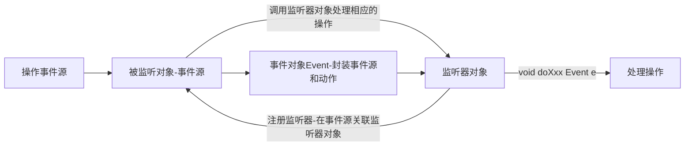
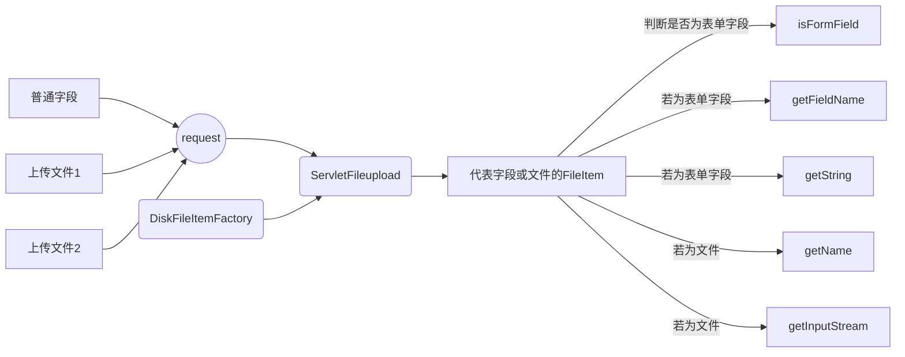

[TOC]

---

# 1. 监听器

## 1.1 监听器(Listener)概述

- 监听器是一个实现特定接口的java程序,此程序专门用于监听另一个java对象的方法调用或属性的改变,发生事件时,执行监听器的某个方法
- 监听器典型案例:监听window窗口的事件监听器
  - 事件ActionEvent
  - 事件源JButton
  - 监听器ActionListener
  - 注册监听addActionListener()




## 1.2 Servlet监听器

- javaweb中的监听器
  - 用于监听javaweb常用对象**request**(HttpServletRequest),**session**(HttpSession),**application**(ServletConetxt)
  - servlet定义了多种监听器,监听的事件源分别是:
  - ServletContext域对象
  - HttpSession域对象
  - ServletRequest域对象
- 事件监听器类型
  - 监听三个域对象的创建与销毁
  - 监听域对象的属性变化,(属性增加,删除)
  - 监听绑定到HttpSession域中的某个对象的状态的事件监听器
    - session绑定javaBean


- servlet规范中定义了三种技术用于监听
  - servlet
  - Listener
  - Filter

###1.2.1 编写监听器

- void doXxx(Event e) {}
- 与其他事件监听器一样,编写servlet监听器也需要**实现一个特定接口**,并针对相应动作**覆盖接口中相应方法**
- 与其他事件监听器不同,servlet监听器的注册不是直接注册在事件源上,而是由web容器负责注册,在web.xml文件中**使用**`<listener>`**标签配置监听器**,web容器自动将监听器注册到事件源
- 一个web容器可配置多个servlet事件监听器,按照在web.xml中的顺序来加载和注册这些servlet事件监听器

##1.3 监听Servlet域对象的创建和销毁的监听器

### 1.3.1 ServletContext监听器

- ServletContextListener接口
  - 用于监听ServletContext域对象的创建和销毁事件
    - ServletContext对象的创建:web服务器启动时针对每一个web应用创建对应的ServletContext对象,代表当前web应用
    - ServletContext对象的销毁:web服务器关闭前先关闭每一个代表web应用的ServletContext对象
  - 当ServletContext被创建时调用:
    - `void contexInitialized(ServletContextEvent sce)`
  - 当ServletContext被销毁时调用:
    - `void contextDestroyed(ServletContextEvent sce)`
- ServletContext应用
  - 保存全局应用数据对象
    - 例如:创建数据库连接池
  - 加载框架配置文件
    - spring框架:配置文件随服务器启动加载
      - org.springframwork.web.context.ContextLoaderListener
  - 实现任务调度(定时器)
    - Timer
    - TimerTask

### 1.3.2 HttpSession监听器

- HttpSessionListener接口
  - 用于监听HttpSession域对象的创建和销毁
    - Session域对象的创建:每有一个用户访问服务器时,服务器就创建一个对应用户的session域对象
    - Session域对象的销毁:如果用户的session在特定时间内(默认30分钟)没有使用,服务器就会销毁session域对象,在web.xml中可配置session失效时间
      - 设置session销毁时间:HttpSession中的方法:`void setMaxInactiveInterval(int interval)`
      - 手动销毁的方法:HttpSession中的方法:`public void invalidate()`
      - 关闭服务器也会销毁session
      - 获取session最后一次使用的时间(毫秒值):`public long getLastAccessedTime()`
  - 当session域对象被创建时调用:
    - `void sessionCreated(HttpSessionEvent hse)`
  - 当session域对象被销毁时调用:
    - `void sessionDestoryed(HttpSessionEvent hse)`

### 1.3.3 ServletRequest 监听器

- ServletRequestListener接口
  - 用于监听ServletRequest域对象的创建和销毁
    - ServletRequeset域对象的创建:用户每一次访问时,创建一个request对象
    - ServletRequeset域对象的销毁:用户每一次的访问结束时,创建的request对象就被销毁
  - 当request域对象被创建时调用:
    - `void requestInitialized(ServletRequestEvent sre)`
  - 当request域对象被销毁时调用:
    - `void requestDestoryed(ServletRequestEvent sre)`

### 1.3.4 演示web监听器如何使用

- 创建监听器的步骤:
  1. 创建一个类,实现指定的监听器接口
  2. 重写接口中的方法
  3. 在web.xml中配置`<listener>`标签用于注册监听器
- 域对象用于创建和销毁的监听器主要用于性能测试操作

## 1.4 监听Servlet域对象属性变化的监听器

- 用于监听Servlet域对象的属性变更信息事件的监听器
- ServletContext监听器接口:ServletContextAttributeListener
- HttpSession监听器接口:HttpSessionAttributeListener
- ServletRequest监听器接口:ServletRequestAttributeListener
- 三个接口中都定义了三个方法用于处理被监听对象的**属性的增加,删除和替换事件**,同一个事件在三个接口中的方法名称都相同,只是参数类型不同

### 1.4.1 监听域对象增加一条属性

- 当域对象增加一条属性后,对应的监听器接口调用此方法进行响应
  - 参数为被监听的事件类型的参数,用于通知域对象属性被更改的事件


- 各个域监听器中对应的方法(**attributeAdded**):
  - `public void attributeAdded(ServletContextAttributeEvent scae)`
  - `public void attributeAdded(HttpSessionBindingEvent hsbe)`
  - `public void attributeAdded(ServletRequestAttributeEvent srae)`

### 1.4.2 监听域对象删除一条属性

- 当域对象删除一条属性后,对应的监听器接口调用此方法进行响应


- 各个域监听器中对应的方法(**attributeRemoved**):
  - `public void attributeRemoved(ServletContextAttributeEvent scae)`
  - `public void attributeRemoved(HttpSessionBindingEvent hsbe)`
  - `public void attributeRemoved(ServletRequestAttributeEvent srae)`

### 1.4.3 监听域对象替换一条属性

- 当域对象替换一条属性后,对应的监听器接口调用此方法进行响应


- 各个域监听器中对应的方法(**attributeReplaced**):
  - `public void attributeReplaced(ServletContextAttributeEvent scae)`
  - `public void attributeReplaced(HttpSessionBindingEvent hsbe)`
  - `public void attributeReplaced(ServletRequestAttributeEvent srae)`

##1.5 感知session绑定的事件监听器

- 保存在session域中的对象可以有多种状态:
  - 绑定到session中
  - 从session域中解除绑定
  - 随session对象持久化储存到一个存储设备中(**钝化**)
  - 随session对象从一个存储设备中恢复(**活化**)
- servlet规范中定义了两个监听器接口用于**帮助JavaBean对象了解自己在session域中的状态**
  - HttpSessionBindingListener接口
  - HttpSessionActivationListener接口
- 这两个监听器特点
  - 由JavaBean对象自己实现
  - 这两个接口无需在web.xml中注册

### 1.5.1 HttpSessionBindingListener

- 用于监听JavaBean对象是绑定到session中还是从session中删除(解绑)
  - 当JavaBean对象被绑定到session中,web服务器调用:
    - `void valueBound(HttpSessionBindingEvent event)`
  - 当JavaBean对象从session中被删除时,web服务器调用:
    - `void valueUnbound(HttpSessionBindingEvent event)`

### 1.5.2 HttpSessionActivationListener

- 用于监听JavaBean对象随session对象被钝化(passivate)还是活化(active)

  - 当JavaBean对象随session对象被钝化前,web服务器调用:
    - `void sessionWillPassivate(HttpSessionBindingEvent event)`
  - 当JavaBean对象随session对象被活化后,web服务器调用:
    - `void sessionDidActive(HttpSessionBindingEvent event)`

- 需要创建一个配置文件context.xml

  - 此文件保存在META-INF目录下

    - ```xml
      <Context>
      //持久管理器 最大空闲交换=1
      <Manager className="org.apache.catalina.session.PersistentManager" maxIdleSwap="1">
      //存储文件空间 目录=根目录/test
      <Store className="org.apache.catalina.session.FileStore" directory="test"/>  
      </Manager>
      </Context>
      ```


---

# 2. 过滤器

## 2.1 过滤器Filter介绍

- Filter称为过滤器,是servlet技术中最实用的技术,通过filter可对web服务器中的**所有web资源**,例如**jsp,servlet,静态图片,静态html文件等**进行**拦截**,从而实现特殊功能,例如实现url级别的权限访问控制,过滤敏感词汇,压缩响应信息等功能

- servlet api中提供了一个Filter接口,开发web应用时,实现此接口的开发的Java类被称作过滤器filter;通过filter技术,可实现用户在访问目标资源前,对访问的请求和响应进行拦截

- ```mermaid
  graph TB;
  	web浏览器-->web服务器;
  	web服务器-->1(过滤器);
  	1(过滤器)-->2(web资源);
  	web服务器-->web浏览器;
  	2(web资源)-->1(过滤器);
  	1(过滤器)-->web服务器;
  ```

- ​

- Filter接口有一个doFilter()方法,当编写好类实现Filter接口,并配置对哪个web资源进行拦截后(url拦截),web服务器在每次调用此web资源前,都会**先调用Filter实现类的doFilter()方法:**

  - 调用目标资源前,可先让一段代码执行
  - 决定是否调用目标资源(是否让用户访问此web资源)
    - web服务器调用doFilter()方法会传递参数**filterChain对象**,此对象也提供一个doFilter()方法,可根据需求决定是否调用此方法;若调用此方法,web服务器会调用目标web资源的service方法,即web资源会被访问;反之,不调用filterChain对象的doFilter()方法,此web资源不会被访问
      - **只有调用了filterChain对象的doFilter(request,response)方法才能够访问目标资源**
  - 调用目标资源后,可让一段代码执行

## 2.2 开发Filter步骤

- 开发Filter分两个步骤:
  1. 编写javax.servlet.Filter接口的实现类,实现
     - 三个方法
       - `destroy()`
       - `init(FilterConfig filterConfig) `
       - `doFilter(ServletRequest request,ServletResponse response,FilterChain filterChain)`
     - 中的doFilter()方法(**必实现**)
  2. 在web.xml中使用`<filter>`标签和`<filter-mapping>`标签对编写的filter实现类进行注册,并设置它所拦截的资源
- Filter链---FilterChain
  - 在一个web应用中可以开发编写多个Filter,这些Filter组合起来称为一个Filter链
  - **web服务器根据所有Filter在web.xml中注册的顺序`<mapping>`标签**,决定先调用哪一个Filter,当第一个Filter的doFilter()方法被调用时,web服务器会创建一个代表Filter链的对象FilterChain传递给该方法;若调用了FilterChain对象的doFilter()方法,则检查FilterChain对象中是否还有第一个Filter对象,若有则调用第二个Filter对象,若无则调用目标资源

## 2.3 Fliter生命周期

- `void init(FilterConifg filterConfig) throws ServletException`
  - Filter的创建和销毁和执行都由**web服务器负责**(与sevlet应用一样)
  - web应用程序**启动时**,web服务器**创建Filter对象**,调用init方法进行**初始化**
    - **filter对象只会创建一次,init方法只会执行一次**
  - 可通过init方法的参数获得代表当前filter配置信息的FilterConfig对象
- `doFilter(ServletRequest request,ServletResponse response,FilterChain filterChain)`
  - 每次filter对象拦截时执行
  - request和response在实际使用中分别代表**HttpServletRequest**和**HttpServletResponse**
- `destroy()`
  - 在web容器卸载Filter对象之前被调用

## 2.4 FilterConfig接口

- 在web.xml配置`<filter>`标签时,使用` <init-param>`内标签为filter配置初始化参数,当web服务器实例化filter对象,调用init()方法初始化时,会把封装了filter初始化参数的filterCinfig对象传递进init()方法作为参数
- 通过filterConfig对象可获得:
  - `String getFilterName()`:得到filter名称
  - `String getInitParameter(String name)`:获取由部署描述指定名称的**初始化参数的值**,没有则返回null
  - `Enumeration getInitParameterNames()`:获取所有过滤器初始化参数名称,以枚举表示
  - `public ServletContext getServletContext()`:获取**servlet上下文对象**的引用

## 2.5 注册与映射Filter

- **注册filter**:在web.xml中配置

- ```xml
  <filter>
  	//过滤器名称,不能为空
  	<filter-name>testFilter</filter-name>
  	//过滤器完整的类名
  	<filter-name>org.test.Filter</filter-name>
  	//过滤器初始化参数
  	<init-param>
  		//初始化参数名
  		<param-name>word_file</param-name>
  		//初始化参数值,filterConfig接口对象可通过方法访问初始化参数
  		<param-value>/WEB-INF/word.txt</param-value>
  	</init-param>
  </filter>
  ```

- **映射filter**

- ` <filter-mapping>` :标签内设定filter拦截的资源,有两种方式

  1. `<servlet-name>` :当所拦截资源是servlet程序时,可通过指定servlet名称拦截资源
  2. `<dispatcher>` :可通过指定资源访问的请求路径

- `<dispatcher>`:指定过滤器所拦截的资源被web服务器调用的方式

  - 值为**REQUEST**时:当用户直接访问资源是,web服务器调用此过滤器
  - 值为**FOWARD**时:当目标资源是通过RequestDispatcher的foward()方法被调用时,web服务器调用此过滤器
  - 值为**INCULDE**时:当目标资源是通过RequsetDispatcher的include()方法被调用时,web服务器调用此过滤器
  - 值为**ERROR**时:当目标资源是通过**声明式异常处理机制**调用时,web服务器调用此过滤器
  - 可设置多个`<dispatcher>`子元素来指定filter对资源进行多种调用方式的拦截

- ```xml
  //设定一个filter所拦截的资源
  <filter-mapping>
  	//所要注册的过滤器名称
  	<filter-name>testFilter</filter-name>
  	//过滤器要拦截的资源名称,若是servlet-name标签则指定servlet名称,若是url-pattern则指定资源的请求路径url
  	<url-pattern>/index.jsp</url-pattern>
  	//dispatcher指定过滤器所拦截的资源被web服务器调用的方式
  	<dispatcher>REQUEST</dispatcher>
  	<dispatcher>FORWARD</dispatcher>
  	<dispatcher>INCLUDE</dispatcher>
  	<dispatcher>ERROR</dispatcher>
  </filter-mapping>
  ```

## 2.6 Filter常见应用

###2.6.1 统一全站字符编码的过滤器

- ```java
  //在过滤器doFilter()方法中插入
  //处理请求post乱码的代码
  requset.setCharacterEncoding("utf-8");
  //设置响应编码集代码
  response.setContentType("text/html;charset=utf-8");
  ```

- 通过web.xml的`<filter-mapping>`标签的`<url-pattern>`值设置为"/*",则代表拦截全站的过滤器

### 2.6.2 禁用所有jsp页面缓存

- jsp动态页面数据为了保证实时性,要一直显示最新数据情况,所以要禁用缓存

- ```java
  //在过滤器doFilter()方法中插入
  //禁用缓存三件套
  response.setHeader("Cache-Control","no-cache");
  response.setHeader("Pragma","no-cache");
  response.setDateHeader("Expires",-1);
  ```

- 通过web.xml的`<filter-mapping>`标签的`<url-pattern>`值设置为"/*",则代表拦截全站的过滤器

### 2.6.3 控制静态资源(如图片)的缓存策略

- 对于服务器上经常不变的静态资源,设置客户端缓存时间,在时间内客户端不会再次请求此资源,减少服务器请求次数,提高性能
- 通过设置Expires过期时间,即可设置静态资源的缓存时间
  - `respinse.setDateHeader("Expires",xxx);`:xxx为缓存存在时间的毫秒值,若为-1则不缓存
- 通过web.xml的`<filter-mapping>`标签的`<url-pattern>`值设置为"/xxx/*",则代表拦截xxx目录下的资源的过滤器
  - 例如`<url-pattern>/img/*</url-pattern>`则代表拦截img目录下的所有资源

### 2.6.4 实现自动登陆(MD5加密)

- 登陆时勾选自动登陆(例如三个月不用登陆)

  - 在登陆成功后,服务器**以cookies形式,发送用户名和密码给客户端**
  - 在客户端中通过MD5加密保存

- 下一次访问登陆页面时,AutoLoginFilter过滤器从cookies中获取自动登陆信息

  1. 判断用户是否已经登陆,若登陆则跳过过滤器
  2. 判断cookie是否有自动登陆信息,若没有则无法自动登陆
  3. 使用cookie的用户和密码完成自动登陆

- MD5加密算法是一个单向加密算法,由明文→密文,不支持解密

  - mysql中:`SELECT MD5('123');`

    - 202cb962ac59075b964b07152d234b70
    - 加密后密码是32位数字,16进制表示

  - Java中提供类MessageDigest完成MD5加密

    - ```java
      /**
      * 使用md5的算法进行加密,参数是要加密的字符串
      */
      	public static String md5(String plainText) {
      		byte[] secretBytes = null;
      		try {
                	  //把要加密的字符串通过MessageDigest转换成md5加密字节数组
      			secretBytes = MessageDigest.getInstance("md5").digest(
      					plainText.getBytes());
      		} catch (NoSuchAlgorithmException e) {
      			throw new RuntimeException("没有md5这个算法！");
      		}
            	 //把加密的字节数组转换成为16进制字符串形式
      		String md5code = new BigInteger(1, secretBytes).toString(16);
      		//若字符串没有32位,则在字符串前拼接0补满至32位
      		for (int i = 0; i < 32 - md5code.length(); i++) {
      			md5code = "0" + md5code;
      		}
      		return md5code;
      	}
      ```

  - 将数据库中所有密码变为密文:`UPDATE user SET password = md5(password);`

  - 在登陆逻辑中,对密码进行MD5加密

  - 在AutoLoginFilter中从cookie获取的都是加密后的密码,所以登陆时无需再次加密

### 2.6.5 URL级别的权限验证

- 在实际开发中,要将一些执行敏感操作的servlet映射到一些**特殊目录中**,使用filter把这些特殊目录保护起来,只有**拥有相应访问权限**的用户才能访问这些目录下的资源,从而实现url级别的权限验证
- 通过配置filter相关信息,使filter可保护相关资源和过滤权限验证
- 例如访问论坛的高级板块

### 2.6.6 通过Filter包装request和response

- filter得到代表用户的响应和请求对象request和response并传递,因此使用**Decorator(装饰器)装饰模式**对request和response对象进行包装,再把包装对象传给目标资源,实现一些特殊需求

- ```mermaid
  graph LR;
  	request-->filter((filter));
  	response-->filter((filter));
  	filter((filter))-->包装的request;
  	filter((filter))-->包装的response
  ```

#### 实现Decorator设计模式

1. 包装类需要和被包装对象实现相同接口或者继承相同父类
2. 包装类需要持有被包装对象的引用
   - 在包装类中定义一个成员变量,变量类型为被包装对象类型
     - 在包装类中定义一个构造函数,传入被包装对象
3. 包装类中,覆盖需要增强的方法,编写增强代码
   - 不需要增强的方法,调用原被包装对象的方法

#### Servlet API中针对request和response的包装类(装饰模式)

- request对象(HttpServletRequest)的包装实现类
  - **HttpServletRequsetWrapper**
    - 实现了request接口的所有方法,但内部实现是直接调用request接口,未增强
    - 根据自己需要**编写子类继承HttpServletRequsetWrapper**,**覆盖需要增强的方法**
    - 通过**编写的filter向目标资源传递自定义的requset对象**
      - 此filter对request进行了包装,获得增强的方法
- response对象的包装实现类
  - **HttpServletResponseWrapper**
    - 具体实现方法同request相同

#### 通过包装类解决编码问题

```java
public class EncodingFilter implements Filter {
	public void destroy() {}
	//重写doFilter方法,实现需要的功能
	public void doFilter(ServletRequest req, ServletResponse resp,
			FilterChain chain) throws IOException, ServletException {
		// 1.强制转换
		HttpServletRequest request = (HttpServletRequest) req;
		HttpServletResponse response = (HttpServletResponse) resp;
		// 2.操作
		HttpServletRequest myrequest = new MyRequest(request); // 增强后的request,解决了编码问题
		response.setContentType("text/html;charset=utf-8");
		// 3.放行
		chain.doFilter(myrequest, response);
	}

	public void init(FilterConfig filterConfig) throws ServletException {}
}

// 装饰类
class MyRequest extends HttpServletRequestWrapper {
	private HttpServletRequest request;
	public MyRequest(HttpServletRequest request) {
		super(request);
		this.request = request;
	}
	// 重写关于获取请求参数的方法.
	//根据参数名获取参数名
	@Override
	public String getParameter(String name) {
		Map<String, String[]> map = getParameterMap();

		if (name == null) {
			return null;
		}
		String[] st = map.get(name);
		if (st == null || st.length == 0) {
			return null;
		}
		return st[0];
	}
	//根据参数名获取参数值
	@Override
	public String[] getParameterValues(String name) {
		Map<String, String[]> map = getParameterMap();
		if (name == null) {
			return null;
		}
		String[] st = map.get(name);
		return st;
	}

	private boolean flag = true;
	
	@Override
	public Map getParameterMap() {
		// 1.得到所有请求参数的Map集合
		Map<String, String[]> map = request.getParameterMap(); // 有编码问题.

		// 2.解决编码问题.
		if (flag) {
			for (String key : map.keySet()) {
				String[] values = map.get(key);

				for (int i = 0; i < values.length; i++) {
					try {
						values[i] = new String(values[i].getBytes("iso8859-1"),
								"utf-8");
					} catch (UnsupportedEncodingException e) {
						e.printStackTrace();
					}
				}

			}
			flag = false;
		}
		return map;
	}
}
```


---

# 3. 文件的上传与下载

## 3.1 文件的上传

- 将客户端的资源,通过网络传递到服务器端
  - 本质是IO流操作


- 通过两步完成文件上传功能

  1. 在web页面添加上传输入选项
  2. 在servlet中读取上传文件的数据,并保存到服务器的硬盘中

- 在web页面添加上传输入项(针对客户端)

  - `<input type="file">`标签用于在web页面添加上传输入项

    - 必须设置input的name属性,否则浏览器不会发送上传文件数据

    - 必须把form的enctype属性值设置为**multipart/form-data**

      - 设置该值后,浏览器在上传文件时将把文件数据附带在http请求消息体中,使用MIME协议对上传文件进行描述,用于对上传数据进行解析处理

    - 表单的提交方式必须是post

    - ```jsp
      <form action="${pageContext.request.contextPath}/upload" method="post" encType="multipart/form-data">
      	<input type="text" name="content"><br>
      	<input type="file" name="file"><br>
      	<input type="submit" value="上传">
      </form>
      ```

- 在servlet中读取上传的数据,保存到服务器硬盘中(针对服务器端)

  - request对象获取请求头信息,通过`ServletInputStream getInuptStream()`方法,获取字节输入流
    - 通过获取的字节输入流`int readLine(byte[] b,int off,int len)`读取到所有请求正文信息
  - 在服务器通过流数据读取到上传文件,再对数据进行解析

- 实际使用中,文件上传使用commons-fileupload上传工具完成上传工作

### 3.1.1 fileupload上传工具

- Apache提供的用于处理表单文件上传的开源组件:commons-fileupload
- 导入jar包:
  - commons-fileupload-x.x.x.jar
    - 文件上传
  - commons-io-x.x.x.jar
    - 提供io工具,对fileupload提供支持
- fileupload组件工作流程




- fileupload的**三个核心**
  1. DiskFileItemFactory类
  2. ServletFileUpload类
  3. FileItem接口

### 3.1.2 文件上传快速入门

1. 创建upload.jsp页面,通过[之前的方法](##3.1 文件的上传)

2. 创建UploadServlet

   1. 创建DiskFileItemFactory对象,带参构造可设置缓冲区大小(sizeThreshold)和临时文件目录(repository)

      - ```java
        DiskFileItemFactory factory = new DiskFileItemFactory();
        ```

   2. 创建ServletFileUpload对象,设置上传文件大小的限制(setFileSizeMax(long fileSizeMax)

      - ```java
        ServletFileUpload upload = new ServletFileUpload(factory);
        ```

   3. 调用ServletFileUpload.parseRequest()方法解析request对象,得到保存了所有上传内容的List对象

      - ```java
        List<FileItem> items = upload.parseRequest(request);
        ```

3. 遍历(迭代)items集合,集合中的每一项就是一个上传数据

   - 每迭代一个FileItem对象,调用其isFormField()方法判断是否是上传文件
     - 若返回true,则为表单字段,可调用getFieldName(),getString()方法得到字段名和字段值
     - 若返回为false,则为上传文件,可调用getInputStream(),getName()方法得到文件的字节输入流和文件名

4. 获取上传文件内容,保存到服务器端

   - 判断为文件后,调用此fileItem对象的getInputSteram()方法

   - 使用文件复制操作完成文件上传

     - ```java
       //调用common-io中的方法
       IOUtils.copy(item.getInputSteam(),fos);
       ```

###3.1.3 fileupload核心API介绍

1. **DiskFileItemFactory类**

   - 是创建FileItem对象的工厂类

   - 作用:设置内存缓存区大小以及临时文件目录下

     - 默认缓存大小:10Kb
     - 默认临时文件目录:再环境变量中查看:`System.getProperty("java.io.tmpdir");`

   - 有参构造方法:

   - ```java
     //设置指定的内存缓冲区大小和指定缓冲区目录
     public DiskFileItemFactory(int sizeThreshold,java.io.File repository)
     ```

   - 成员方法:

     - `public void setSizeThreshold(int sizeThreshold)`
       - 设置内存缓冲区大小,当上传文件大于缓冲区大小,f**ileupload组件将使用临时文件缓存上传文件**
     - `public void setRepository(java.io.File repository)`
       - 指定临时文件目录

2. **ServletFileUpload类**

   - 负责处理上传的文件数据,**将表单中的每个数据封装成一个个fileItem对象**
   - 构造方法:`public ServletFileUpload(FileItemFactory fileItemFactory)`
     - 创建一个上传工具,使用指定文件工厂
   - 成员方法:
     - `static final boolean isMultipartContent(HttpServletRequest request)`
       - 判断上传表单是否可以上传,判断encType="multipart/form-data",true则可以上传表单
         - 此编码方式与url编码方式不同,**不能使用setCharacterEncoding解决乱码问题**
     - `List<FileItem> parseRequest(HttpServletRequest request)`
       - 解析request对象,将请求体每个部分(上传的每一项)都包装成一个个FileItem对象,并返回一个保存了所有fileItem的list集合
     - `void setFileSizeMax(long fileSizeMax)`
       - 设置单个文件的上传最大值
       - `void setSizeMax(long sizeMax)`
         - 设置总文件上传大小
     - `void setHeaderEncoding(String encoding)`
       - 设置编码集,用于解决上传文件名为中文的乱码问题
     - `void setProgerssListener(ProgressListener pListener)`
       - 通过指定监听器监听文件上传状态

3. **FileItem接口**

   - 表示单个上传文件对象或者普通表单的单项
   - 成员方法:
     - `boolean isFormField()`
       - 判断是否为表单字段,false则为上传文件
     - 若判断是一个表单字段
       - `String getFieldName()`:获得普通表单对象的name属性
       - `String getString(String encoding)`由指定编码集解码获得表单对象的value值
     - 若判断是一个文件
       - `String getName()`:获得上传文件的文件名
       - `InputStream getInputStream()`:获得上传文件的输入流
       - `void delete()`:删除临时文件(在关闭FileItem输入流后)

4. 关于文件上传时乱码的问题

   1. 上传文件名乱码

      - 不能使用request.setCharacterEncoding解决乱码问题


      - ```java
        servletFileUpload.setHeaderEncoding("utf-8");
        ```

   2. 非上传组件内容乱码(普通编写项)

      - ```java
        FileItem.getString("utf-8");
        ```

   3. 上传文件数据本身不会乱码,因为使用字节流进行复制

### 3.1.4 多文件上传

- JavaScript中多文件上传表单技巧:

  - 每次动态增加一个文件上传输入框，都把它和删除按纽放置在一个单独的div中，并对删除按纽的onclick事件进行响应，点击"删除按钮"时,同时删除"删除按纽"所在的div。

  - `this.parentNode.parentNode.removeChild(this.parentNode);`

  - ```jsp
    <script type="text/javascript">
    	function addFile(){
    		var div=document.getElementById("content");		
    		div.innerHTML+="<div><input type='file' name='f'><input type='button' value='remove file' onclick='removeFile(this)'></div>";
    	}
    			
    	function removeFile(btn){
    		document.getElementById("content").removeChild(btn.parentNode);
    	}
    </script>
    ```

### 3.1.5 关于文件上传的注意事项

1. 上传文件在服务器端**保存位置**的问题

   1. 保存在可以被浏览器直接访问的位置
      - 例如:商城商品的图片
      - 保存在工程的webroot根目录下及子目录的路径(不包含META-INF和WEB-INF及子目录
        - 例如:WebRoot/img
   2. 保存在不能被浏览器直接访问的位置
      - 例如:付费视频
      - 保存在工程中META-INF及WEB-INF目录及其子目录
        - 例如:WebRoot/WEB-INF/upload
      - 或者保存在不在工程目录的服务器的磁盘目录下(不受web服务器管理的目录)
        - 例如c:\videos

2. 上传文件在同一目录重名的问题

   - 重名的话后一个文件会覆盖前一个文件
   - 应保证文件名的唯一性
     1. 使用毫秒值+原文件名
     2. 使用uuid
        1. ```java
           filename = UUID.randomUUID().toString() + "_" + filename;
           ```

3. 同一目录下文件过多的问题

   - 文件过多影响文件读写速度,采用目录分离算法将上传文件分散储存

     1. 按照上传时间进行目录分离(周,月)

     2. 按照上传用户进行目录分离

        1. 为每个用户建立单独目录

     3. 按照固定数量进行目录分离

        1. 假设每个目录存放1000个文件,存满1000个文件后,新建一个目录

     4. 按照文件名的hashcode进行目录分离

        - ```java
          public static String generateRandomDir(String uuidFileName) {
          	// 获得唯一文件名的hashcode
          	int hashcode = uuidFileName.hashCode();
          	// 获得一级目录
          	int d1 = hashcode & 0xf;       
          	// 获得二级目录
          	int d2 = (hashcode >>> 4) & 0xf;
          	/// 获得三级目录...

          	return "/" + d2 + "/" + d1 + "/";// 共有256个目录
          }
          ```


## 3.2 文件的下载

- 常见文件下载的方式:

  1. 超链接下载:超链接直接指向下载资源,若浏览器可以识别,打开文件;浏览器不能识别则弹出下载窗口

     - 客户端访问服务器静态资源文件时，静态资源文件是通过**缺省Servlet**返回的，在tomcat配置文件conf/web.xml 找到 --- org.apache.catalina.servlets.DefaultServlet

     - ```jsp
       //download.jsp
       <a href='${pageContext.request.contextPath}/upload/a.bmp'>a.bmp</a>
       ```

  2. 服务器端通过流下载(服务器端编程)

     1. 创建下载链接

        - ```jsp
          //注意与超链接不同
          <a href='${pageContext.request.contextPath}/downloadservlet?filename=a.bmp'>a.bmp</a>
          ```

     2. **创建DownloadServlet**

        1. 得到要下载的文件名

           - ```java
             String filename = request.getParameter("filename");
             ```

        2. 判断文件是否存在

           - ```java
             File file = new File("d:/upload/" + filename);
             if (file.exists()) //存在则进行下一步
             ```

        3. 进行下载

           1. 原理:通过response获取输出流,将要下载的文件数据写回到客户端

           2. 程序实现下载需要设置两个响应头

              1. 设置Content-Type值为下载文件对应的MIME类型
              2. web服务器指定浏览器不解析文件,改由用户选择处理文件,通过设置Content-Dispostion
                 - **设定Content-Dispostion前一定要先指定Content-Type**

           3. ```java
              //将下载文件写回到浏览器端
              response.getOutputStream();
              //设置MIMEType
              response.setContentType(getServletContext.getMimeType(filename));
              //设置响应头永远是下载操作
              String dispostion= "attachement;Filename=" + filename;
              response.setHeader("content-disposition",dispositon);
              ```

- 文件下载的乱码问题:

  1. 下载时中文名称资源查找不到

     - 原因:

       - ```jsp
         <a href='${pageContext.request.contextPath}/download?filename=天空.mp3'>天空.mp3</a>
         ```

         - 这是get请求

       - 在服务器端:

         - ```java
           String filename = request.getParameter("filename");
           filename = new String(filename.getBytes("iso8859-1"),"utf-8");
           ```

  2. 下载文件显示中文的乱码问题:

     - ```java
       response.setHeader("content-disposition", "attachment;filename="+filename);
       //IE要求filename必须是utf-8编码,firefox要求filename必须是base64编码
       ```

     - 通过判断浏览器来处理编解码问题

     - ```java
       String agent = request.getHeader("user-agent");
       	// IE浏览器的user-agent属性值中包含MSIE
       	if (agent.contains("MSIE")) {
       		filename = URLEncoder.encode(filename, "utf-8");
       		filename = filename.replace("+", " ");
       	} 
       	// 火狐浏览器
       	else if (agent.contains("Firefox")) {
       		BASE64Encoder base64Encoder = new BASE64Encoder();
       		filename = "=?utf-8?B?" + base64Encoder.encode(filename.getBytes("utf-8")) + "?=";
       	} 
       	// google浏览器
       	else if (agent.contains("Chrome")) {
       		filename = URLEncoder.encode(filename, "utf-8");
       	} else {
       	// 其它浏览器
       		filename = URLEncoder.encode(filename, "utf-8");
       }
       ```


## 3.3 网盘案例

1. 创建表

   - ```mysql
     create database resources;

     create table resources(
     	id int primary key auto_increment,
     	uuidname varchar(100) unique not null,
     	realname varchar(40) not null,
     	savepath varchar(100) not null,
     	uploadtime timestamp ,
     	description varchar(255)
     );
     ```

2. 导入jar包

   - jsp-api / servlet-api


   - c3p0
   - commons-fileupload / commons-io
   - dbutils
   - mysql驱动
   - jstl
   - c3p0-config.xml

3. 编码实现上传

   1. 在index,jsp添加上传链接

      - ```jsp
        <a href='${pageContext.request.contextPath}/upload.jsp'>上传</a>
        ```

   2. 创建upload.jsp页面

      - 上传操作浏览器端三个注意事项:

        1. method=post

        2. encType="multipart/form-data"

        3. 使用`<input type="file" name="f">`

           - ```jsp
             <form action="${pageContext.request.contextPath}/upload" method="post" enctype="multipart/form-data">
             	<input type="file" name="f"><br>
             	描述:<input type="text" name="description"><br>
             	<input type="submit" value="提交">
             </form>	
             ```

   3. 创建UploadServlet

      1. 完成上传操作
         - commons-fileupload
           1. DiskFileItemFactory
           2. ServletFileUpload
           3. FileItem
      2. 将数据封装,存储到数据库
         - 将数据封装到javaBean
           - 手动创建一个`Map<String,String[]>`将数据封装到map集合
           - 通过BeanUtils完成数据封装

   4. 下载操作

      1. 在index.jsp页面,下载链接会访问一个servlet,得到所有可下载数据,在页面上展示

         1. index,jsp代码

            - ```jsp
              <a href="${pageContext.request.contextPath}/showDownload">下载</a>
              ```

         2. 创建ShowDownloadServlet

            - 在这个servlet中,查看数据库,得到所有可以下载的信息

            - ```java
              List<Resource> rs= service.findAll();
              ```

         3. 创建一个download.jsp页面,展示所有可以下载的信息

      2. 在download.jsp,点击下载时,传递的是要下载文件的id

         - ```jsp
           <a href='${pageContext.request.contextPath}/download?id=${r.id}'>下载</a>
           ```

         - 创建一个DownloadServlet

           1. 查询数据库,得到要下载文件的相关信息
           2. 下载操作


---

# 4. 国际化

## 4.1 国际化概述

- 国际化简称i18n:internationalization
- 软件国际化:软件开发时,要使之能同时适应世界各地不同国家和地区的访问,并针对不同国家和地区提供相应的页面和数据
- 软件国际化实施特征:
  - 对于程序中**固定使用的文本元素**,根据来访者的国家和地区选择不同的语言文本
    - 例如:菜单栏,导航条,文本元素,错误提示信息,状态信息
  - 对于程序动态产生的数据,如**日期和货币**,程序根据当前所在的国家和地区进行选择

## 4.2 软件国际化

###4.2.1 现软件国际化的步骤

1. 将要针对国家和地区显示的信息,,例如菜单栏,导航条,错误提示信息,状态信息等,都**配置到properties配置文件中**
2. 不同的国家地区编写不同的properties属性文件,这一组配置文件组成一个**资源包(ResourceBundle)**
3. 当访问者访问时,根据其国家或语言特征从资源包中不同的配置文件获取信息

### 4.2.2 资源包和资源文件

- JavaAPI中提供了ResourceBundle类用于描述资源包,提供相应方法如getBundle,根据来访者国家和地区自动获取与之对应的资源文件予以显示

- 资源包ResourceBundle中所有的properties文件必须具有相同的**基名(basename)**,命名格式为:

  - `基名_语言_国家.properties`

  - 例如:

    - ```
      myproperties_zh_CN.properties
      myproperties_en_US.properties
      myproperties_zh.properties
      myproperties_en.properties
      ```

- 每个资源包都有一个**默认资源文件**,此文件文件名只有基名,无语言和国家标识,如`myproperties.properties`

  - 当ResourceBundle对象在资源包中找不到与用户匹配的资源文件,则选择最相近的资源文件,若再找不到则使用默认资源文件

- properties书写格式

  - 采用"**关键字=值**"的形式,程序根据关键字检索后使用其值在页面上

  - 一个资源包中所有资源配置文件的关键字必须相同一一对应,值为相应国家,语言的文字

  - properties中所有字符必须是ASCII码,对于像中文的非ASCII字符,须先进行编码

    - properties**不能保存中文的**
    - java提供了native2ascii命令用于编码

  - ```properties
    //resource_en.properties
    username=username
    password=password
    submit=submit

    //resource_zh.properties
    username=\u7528\u6237\u540d
    password=\u5bc6\u7801
    submit=\u63d0\u4ea4
    ```

## 4.3 编程实现固定文本的国际化

1. 资源包文件一般都放置在classpath下(对于myeclipes是src下)

2. 使用ResourceBundle

   1. 创建:

      - ```java
        //ResourceBundle.getBundle(String baseName);
        ResourceBundle bundle = ResourceBundle.getBundle("myproperties");
        ```

   2. 读取properties文件内容

      1. ```java
         //指定一个Locale对象
         //ResourceBundele.getBundle(String baseName,Locale locale)
         ResourceBundle bundle = ResourceBundle.getBundle("myproperties",Local.US);
         ```

      2. 参数：

         - baseName - 资源包的基本名称，是一个完全限定类名
         - locale - 资源包所需的语言环境 
           - 如果与该locale对象匹配的资源包子类找不到。一般情况下，则选用操作系统默认资源文件予以显示

      3. 获取参数

         - ```java
           //bundle.getString(String name);
           bundle.getString("username");
           ```

      4. properties文件中文处理:

         1. jdk命令native2aseii.exe

            1. 翻译操作:

               1. cmd
               2. native2ascii 回车
               3. 要翻译的中文 回车

            2. 批量翻译:

               1. ```cmd
                  native2ascii 源文件路径 目录文件路径
                  例如:
                  native2ascii d:\a.txt d:\a.properties
                  ```

### 4.3.1 国际化的登陆页面

- 步骤

  1. 创建登陆页面

  2. 创建配置文件

  3. 在登陆页面根基不同国家和地区获取ResourceBundle

  4. 在页面上需要国际化的位置,通过ResourceBundle.getString()获取信息

     1. 为了避免在页面上使用jsp代码,使用标签来代替程序

        1. jst标签库中提供了国际化的标签`<fmt>`

     2. 将jstl的jar库引入WEB/lib

     3. 页面引用fmt标签库

        1. ```jsp
           <%@taglib prefix="fmt" uri="http://java.sun.com/jsp/jstl/fmt" %>
           ```

     4. 设置locale:相当于`Locale locale = new Locale()`;

        1. ```jsp
           <fmt:setLocale value="${param.locale}"/>
           ```

     5. 创建ResourceBundle:相当于`ResourceBundlebundle bundle = ResourceBundle.getBundle("myproperties",locale);`

        1. ```jsp
           <fmt:setBundle basename="myproperties" var="bundle" scope="page" />
           ```

     6. 显示message,相当于`bundle.getString(key);`

        1. ```jsp
           <fmt:message bundle="${bundle}" key="login.info" />
           <fmt:message bundle="${bundle}" key="login.username" />
           ```

## 4.4 日期格式化

- **DataFormat类**(设计模式:单例模式)

  - 将日期或时间对象格式化为表示摸个国家地区的日期或时间格式的字符串
  - 将一个String解析成Date对象

- DateFormat定义的日期或时间的**显示模式(格式化风格)**的**静态常量**

  - **FULL,LONG,MEDIUM,DEFAULT,SHORT**
  - 实例化DateFormat对象时,使用这些常量控制日期或时间的显示长度

- 实例化DateFormat类

  1. 不处理时间部分,以**指定日期显示模式**和本地信息获得DateFormat对象

     - ```java
       public static final DateFormat getDateInstance();
       //默认显示模式和默认本地信息
       public static final DateFormat getDateInstance(int style);
       //指定显示模式(格式化风格)
       public static final DateFormat getDateInstance(int style,Locale aLocale);
       //style - 给定的格式化风格。例如，SHORT 用于 US 语言环境中的 "M/d/yy"。
       //aLocale - 给定的语言环境。
       ```

  2. 不处理日期部分,以**指定时间显示模式**和本地信息获得DateFormat对象

     - ```java
       public static final DateFormat getTimeInstance();
       public static final DateFormat getTimeInstance(int style);
       public static final DateFormat getTimeInstance(int style,Locale aLocale);
       ```

  3. 日期时间都显示

     - ```java
       public static final DateFormat getDateTimeInstance();
       public static final DateFormat getDateTimeInstance(int dateStyle,int timeStyle);
       public static final DateFormat getDateTimeInstance(int dateStyle,int timeStyle,Locale aLocale);
       //dateStyle - 给定的日期格式化风格。例如，SHORT 用于 US 语言环境中的 "M/d/yy"。
       //timeStyle - 给定的时间格式化风格。例如，SHORT 用于 US 语言环境中的 "h:mm a"。 
       ```

## 4.5 数字格式化

- **NumberFormat类**(设计模式:单例模式)

  - 实例化时可以使用locale对象作为参数进行实例化;也可不使用locale对象

- 实例化方法:

  1. 获取**多种用途(通用)**的数值格式实例

     - ```java
       public static NumberFormat getNumberInstance(Locale inLocale)
       ```

  2. 获取处理**整数**的数值格式实例

     - ```java
       public static NumberFormat getIntegerInstance(Locale inLocale);
       ```

  3. 获取处理**货币**的数值格式实例

     - ```java
       public static NumberFormat getCurrencyInstance(Locale inLocale);
       ```

  4. 获取处理**百分比数值**的数值格式实例

     - ```java
       public static NumberFormat getPercentInstance(Locale inLocale);
       ```

## 4.6 动态文本格式化

- **MessageFormat类**

  - 对一个模板中的类进行动态赋值
    - 当一个字符串包含多个与国际化相关的数据时,使用此类对这些数据进行批处理

- MessasgFormat类进行批处理

  - 允许在数据信息中将动态数据抽取出来，使用{0} {1} {2} 占位符进行占位，达到动态生成效果

    - 占位符只能使用{0}---{9}之间的数值

      - 占位符格式:
        1. **{argumentIndex}**: 0-9 之间的数字，表示要格式化对象数据在参数数组中的索引号
           - 如{0} {1} {2}
        2. {argumentIndex,**formatType**}: 参数的格式化类型
           - formatType可以取的值有:number | date | time
           - 如{0,number} {1,date} {2,time}
        3. {argumentIndex,formatType,**FormatStyle**}: 格式化的样式，它的值必须是与格式化类型**相匹配**的合法模式、或表示合法模式的字符串。
           - formatStyle可以取的值有:
             - number类型可以取:integer | currency  | percent 
             - date类型可以取的:short | medium | full | long
             - time类型可以取的:short | medium |  full | long	
           - 如{0,number,integer} {1.date,medium} {2,time,long}

    - MessageFormat类在格式化输出包含占位符的文本时，MessageFormat类可以接收一个**参数数组**，以**替换**文本中的每一个占位符。

      - ```java
        public static String format(String pattern,Object... arguments);
        //pattern - 要格式化的字符串
        //arguements - 替换语句中的占位符的参数
        ```

    - 举例:

    - ```java
      String pattern = "At {0,time,short} on {0,date,medium},a destroyed {1} 
      houses and caused {2,number,currency} of damage."

      Calendar calendar = Calendar.getInstance();
      calendar.set(1998, 6, 3, 12, 30, 0);
      Date date = calendar.getTime();

      Object []msgArgs = {date, 99, 1000000};

      String result = MessageFormat.format(pattern,msgArgs); // 默认国家
      System.out.println(result);

      ```

    - 可采用**指定Locale**进行国际化

      - ```java
        //pattern - 要格式化的语句
        //locake - 指定国家或区域
        //arg - 替换语句中的占位符的参数
        MessageFormat formater = new MessageFormat(pattern,locale);
        formater.format(args);

        ```

